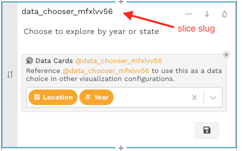
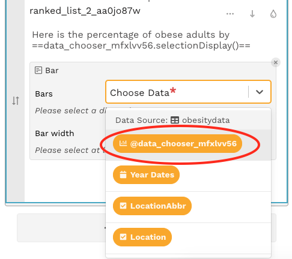
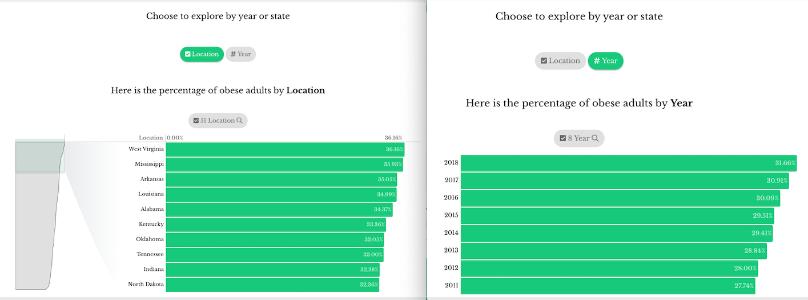

# Data Card

A data card chart can be used to for the following:

* Show a summary of measures
* Let a user choose which measure to explore 
* Let a user choose which dimension to explore

Choices made in a data card can drive the filtering narrative of the story that follows. There are two types: measure data card and dimension data card.

## Data card chart with measures

A data card chart with measures will display a high-level summary that provides context for users as they make their selections. The selection made in a measure data card slice can be used as a [dynamic measure](data-card.md#using-dynamic-ingredients) ingredient in other charts, allowing for user-driven exploration.

#### To add a measure data card slice:

* select **Data card** from the chart list
* select the measures you want to add in the order you want them displayed
  * Once you select the first measure, the app will remove the dimensions as options, as you cannot mix dimensions and measures
* add title text \(optional\)

## Data card chart with dimensions

A data card chart with dimensions \(i.e., a dimension data card slice\) lets users select one dimension from a group of dimensions. The selection made in a dimension data card can be used as a [dynamic dimension](data-card.md#using-dynamic-ingredients) ingredient in other charts, allowing for user-driven exploration.

#### To add a dimension data card slice:

* select **Data card** from the chart list
* select the dimensions you want to add in the order you want them displayed
  * Once you select the first dimension, the app will remove the measures as options, as you cannot mix dimensions and measures
* add title text \(optional\)

## Using dynamic ingredients

Data card slices are particularly powerful when slices further down the app refer to the selections in the data card.


Data card values will be "display only" \(i.e., unselectable\) unless a downstream slice includes a dynamic ingredient referring to the data card.


To reference the selection made in a data card slice**:** 

* Create a dimension data card or measure data card using the above instructions
* In a slice that is below the data card slice that should be referenced, select the data card's slice slug in the dimension drop down and/or measure drop down


A slice can reference both a dimension data card and a measure data card in the respective dimension and measure drop downs.


