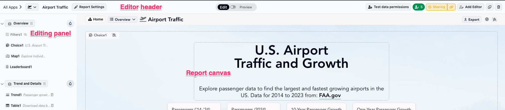

# Design

When you open a report in Edit mode, you'll see three main areas:

* **Editor header** — report identity, settings, and sharing controls
* **Editing panel** — the left sidebar where you manage sections and slices
* **Report canvas** — the main area where you preview and interact with your draft report

<figure><figcaption></figcaption></figure>

## Editor header

The editor header runs across the top of the editing view and contains:

* **Icon** — click the icon to change it. The icon appears on the home page and in the report header.
* **Report name** — click to edit. The name appears on the home page and in the report header. Aim for 1–3 words.
* [**Report Settings**](report-settings.md) — opens a panel for managing the report description, pages, theme, header style, and other settings.
* **Edit / Preview** toggle — switch between editing and previewing the report.
* **Test data permissions** — preview how the report looks for different user roles.
* **Start Sharing** — publish or share report changes with viewers.
* **Add Editor** — [add editors](../../managing-users/adding-users.md#adding-editors-to-your-workspace) to the workspace.
* **Duplicate Report** — create a copy of the report.
* **Delete Report** — permanently delete the report.

## Editing panel

The editing panel on the left sidebar shows the [sections](sections.md) in your report and the [slices](slices/) within each section. From here you can add, reorder, and configure sections and slices.

Click a section badge to configure its layout and style. Click a slice name to select it and configure it in the report canvas.

## Report canvas

The report canvas on the right shows a live preview of your draft report. You can type text directly into slices, interact with charts, and see how the report looks as you make changes. Slices that haven't been configured yet show a placeholder message.
