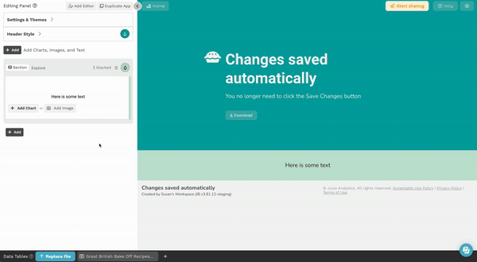
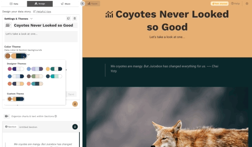
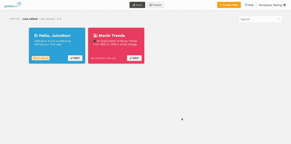
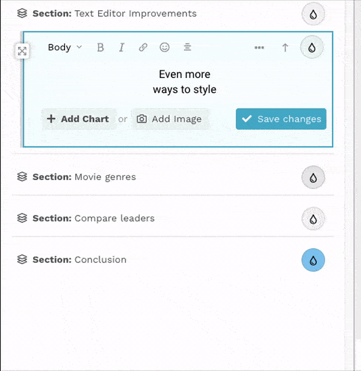
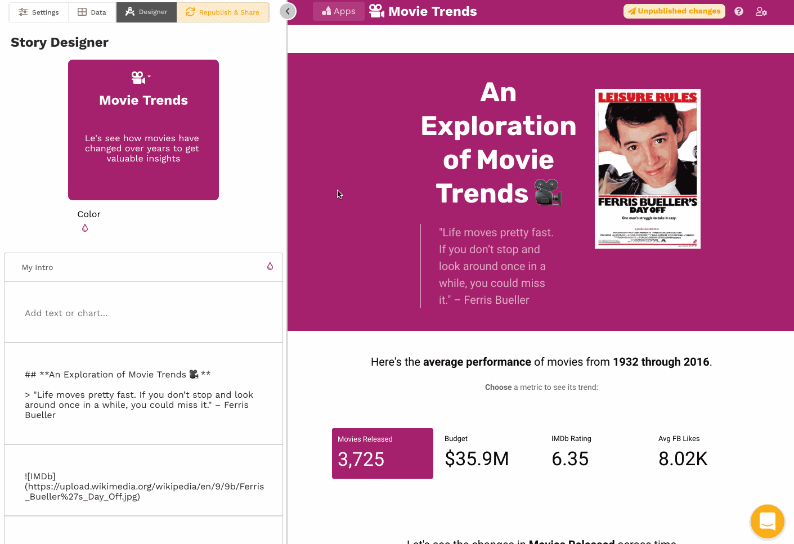
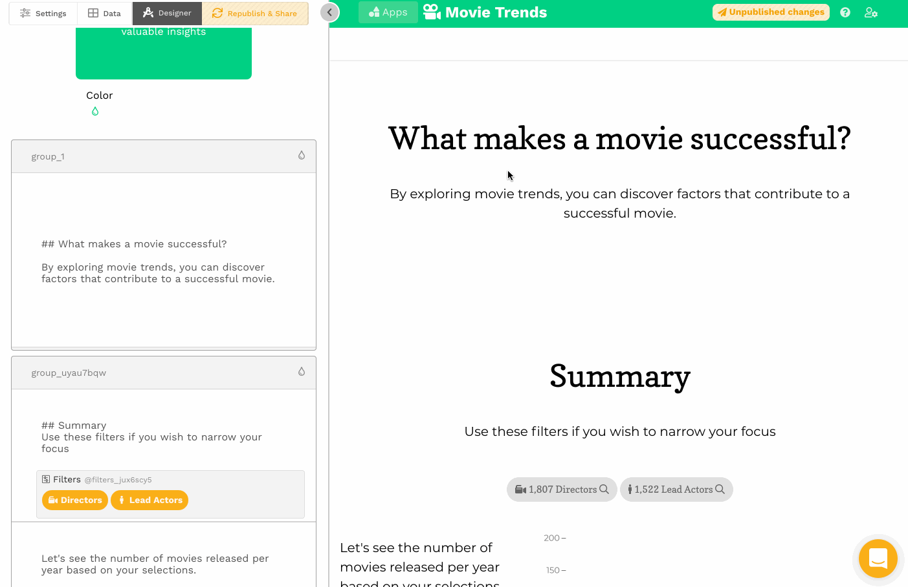
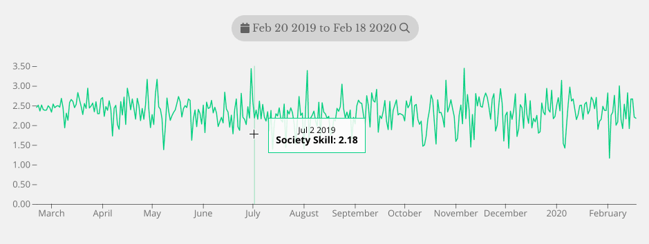

# Changelog 🎁

## What's coming soon?

* A new chart type for displaying data-driven text.
* A new chart type for displaying multiple metrics at once.&#x20;
* The option to use shapefiles in the map chart.
* Many additional advanced report design options available through our report design consulting services.

## Jan 9, 2023

### 🎁 What's new?

* Our new **Insights** feature (available to Business plan subscribers) lets you easily capture a particular insight within a report and share it using Powerpoint, email, Slack, or other tool of your choice. Use Insights to highlight the key takeaways and invite deeper conversation about the story your data is telling. (If you're on the Starter plan and would like to see Insights in action, just [reach out to us](mailto:help@myjuicebox.io).)&#x20;
* With the new Selection option, you can make a chart display only (_Select none_) or require a single selection (_Select one_). By default, charts allow multiple selections (_Select many_).

### 🐛 Bug fixes & other improvements

* Selecting date ranges in a date filter is easier with our improved date picker.&#x20;
* Reordering columns and measures within a chart was broken, but it's fixed now.&#x20;

## August 8, 2022

### 🎁 What's new?

* **Share a Juicebox Report link with a Password:** We've added a "middle of the road" option for Report Sharing. In addition to **Public** sharing ("Anyone with the link") and **Private** sharing ("sign-in required") Juicebox now has the ability to share a **Link with a Password**. This provides some control over who can view your report without requiring that they have a Juicebox account to see what you shared (but it's still private.)

.png>)

### 🐛 Bug fixes & other improvements

* How many page views do you have left for this billing period? Now you can keep track by clicking the Share button for any report.&#x20;
* Quickly navigate from one report to another using the Home button dropdown in the header of any report.
* Duplicate and delete reports directly from the Home page.

## July 7, 2022

### 🎁 What's new?

* Sharing options have been redesigned for more clarity. There are three sharing options:
  * 📢 Sharing as "Public" is now "Anyone with the link," and just like the name says (now 😊) this sharing mode allows anyone with the link to view the report.
  * 🔐 Sharing as "Private" is now "Sign in required." This mode requires people to sign in to Juicebox before they can see the report. There are two sub-sharing-options for this mode:
    * "Send an email" will send a single-use invite link to the recipient you specify.
    * "Share a multi-use invite" creates an invite link that can be used any number of times, but still requires the viewers to sign in to see the report. _**Pro tip:** you can have your recipients forward this invitation so others can join... after signing in, of course._

.png>)

### 🐛 Bug fixes & other improvements

* Juicebox "apps" are now called "reports"
* Improvements to data uploading
* Date range selections in Filter slices are now done with a calendar picker

## May 12, 2022

### 🎁 What's new?

* As you make changes to charts, text, and colors, your app will update automatically! 🎉

### 🐛 Bug fixes & other improvements

* In the filter slice, you can now filter on a range of values in a number column. &#x20;
* Custom color themes are now easier to update.

## April 20, 2022

### 🎁 What's new?

* 📣 Introducing our newest chart type — **Pie charts!** 🥧 \
  \
  Confession time: Over the years, we've sidestepped the Great Pie Chart Controversy (Really? [Yes](http://www.perceptualedge.com/articles/08-21-07.pdf). [Oh yes](https://www.storytellingwithdata.com/blog/2011/07/death-to-pie-charts).) by not offering a pie chart. But not anymore! Our pie chart is beautiful, simple to make, and automatically avoids those perilous pie-chart pitfalls. It's the right chart for showing parts of a whole, and we think you'll love it. Give it a try!

### 🐛 Bug fixes & other improvements

* Would you like to embed a Juicebox app in your own website? Just paste in the public app [embed code](editing-apps/publish-and-share/sharing-and-access-controls.md#embedding-a-public-app).&#x20;
* Trend charts are working again for measures with solely negative values.

## April 6, 2022

### 🎁 What's new?

* You can now export an app as either a PDF or PNG file. Just look for the **Download** button in the app header or header bar.&#x20;

### 🐛 Bug fixes & other improvements

* You can create a Count measure using a boolean column. That used to be False, but now it's True.&#x20;
* Dynamic text that references selections in the filter slice is working.&#x20;

## March 10, 2022

### 🎁 What's new?

* Four new font themes give you more options for setting the tone of your app.&#x20;
* Four new color themes add both dark and light palettes.

### 🐛 Bug fixes & other improvements

* Selections made for one filter pill in the Filter slice now filter across all other filter pills, so you don't have to worry about the order of columns. Filtering performance has improved too.
* Did you know you can duplicate an app? The **Duplicate App** button is now at the top of the editing panel to make that more findable.&#x20;
* Higher numbers are often better (🏀), but not always (⛳️). A new [advanced measure](editing-apps/data-sources/advanced-ingredients/) option lets you tell Juicebox when a lower measure value is better, so that the Leaderboard chart shows who's really on top. &#x20;

## February 11, 2022

### 🎁 What's new?

Ok, y'all. This is a big one. Like, **the biggest update we've ever done**. In this release, we're finishing our journey to remove the editing tabs in the editing panel on the left of the workspace. Some really important things are moving around ("_where's my data??_" and "_so... how do I share now?_" might be questions you'll ask). So, take a moment to review the highlights:

* The **Data Tables drawer** replaces the Data tab
  * We've moved the Data tab to a drawer at the bottom of the window so you can easily see your data while you work. This gives you a clearer view of all your data and lets you switch between them more easily.
  * You can update your data using the easier-to-find **Replace file** button
  * A nice bonus: Now you can Download data tables making collaborating with other Editors easier than ever
* The **Sharing** button replaces the Share tab
  * We've moved the Sharing tab to a button in the upper right of the window that is always present, regardless of what you're doing in the editor. Now, you can quickly save and share your work with the click of a button.

### 🐛 Bug fixes & other improvements

* Leaderboard charts now have a bold new look. _Really_ bold.&#x20;
* Leaderboard, Trend, and Map charts now use colors that are based on the color theme.&#x20;
* A newly designed Resource Center (in the bottom right of the window) and videos help you get the most out of Juicebox.
* Column and measure pills have a new, cleaner look and are easier to remove from charts.
* For apps with multiple data tables, a new chart configuration option lets you choose which data table to use in the chart.&#x20;

## December 8, 2021

### 🎁 What's new?

* **Add images to the background of your header and sections**. Take your data story style to the next level by adding background images to headers and sections. You can add your own images or find images on Unsplash.&#x20;

 (1) (1).png>)

* **Streamlined data prep**. We've added lots of smarts to our data loading process so you can spend less time on data prep, more time telling your data story. &#x20;

### 🐛 Bug fixes & other improvements

* New editing panel improvements help you get to the right place.
* Charts no longer allow configuration if data has not been loaded.

## October 19, 2021

### 🎁 What's new?

* **Easier color makeovers.** Quickly see how your app looks in a whole new wardrobe. Themed color palettes make it easy to change the look of your app in one click.&#x20;

* **Easier to use data**. Now you can use all of your data columns as either dimensions or measures in charts. And you can decide how you want to calculate measures as you're adding charts to your story.

### 🐛 Bug fixes & other improvements

* A simpler way to create locations while making a map.
* Selections in table charts now filter properly (i.e., based on all columns, not just the first one).
* Improved performance for paginated charts.
* Deleting or duplicating apps, sections, and slices is easier with new  and  buttons.
* Broken ingredients are (mostly) a thing of the past.
* Improvements to data loading workflow.&#x20;

## September 28, 2021

### 🎁 What's new?

* **Templates added to the **_**+Create New**_** app workflow**. We've incorporated templates of some of our best Juice-approved app designs into the workflow where you create a new app. These templates include full apps, and singular (but sweetly styled) charts that you can pick from. You can also add complete example apps to your workspace to use as inspiration and reference. Now, that data report idea you have can get the Juice-approved kick start you've been looking for.

### 🐛 Bug fixes & other improvements

* The map can display locations even if no measures have been selected.
* Option to skip app setup details. If you want to accept the defaults and open your new app quickly, you can select **Skip Setup** in the app creation wizard.&#x20;
* Loading data from Excel files has been improved.
* Other reliability and operational improvements.

## September 7, 2021

### 🎁 What's new?

* **Choosers have a new look.** Chooser buttons are now sized based on their content and have a more eye-catching appearance.

.png>)

* **Support for private editing notes.** Now you can leave notes in apps for yourself and other editors that won't be seen by your users.

### 🐛 Bug fixes & other improvements

* Public app links shared on Facebook and Slack look better.
* Dynamic text can now be copied using the slice "@" button and pasted into the text of a downstream slice.&#x20;
* Added Excel files (.xls and .xlsx) to data upload options (for now this defaults to loading only the first Excel tab).
* Other improvements to the Design tab to make adding and configuring slices easier.

## August 13, 2021

### 🎁 What's new?

* **More ways to style text.** And now, with even _more_ style! You can add numbered lists, bulleted lists, and block quotes. The text in your editor panel now looks more like it _actually_ does in your app.

* **Less ingredient clutter.** A big, unorganized pile of ingredients makes it hard to cook—and hard to build your Juicebox app. The new tidy _and separate_ columns for measures and dimensions mean there's less clutter with your ingredients. _Bon appétit_! 🍱

### 🐛 Bug fixes & other improvements

* Adding charts is quicker and easier.
* Improved trend legends.
* Backend synchronization has been improved.

## July 26, 2021

### 🎁 What's new?

* **✨New text editor✨** With our new text editor, you can add and style text, emojis 🔥, and links with ease. Huzzah! (But if you still want to get down with Markdown, you can do that too.)
* **Multi-line trend.** Now you can show up to 5 measures in a single trend chart. Compare to a target or a moving average (or both!) and bring context and clarity to changes over time. And if you want dual vertical axes, you can do that too.&#x20;

* **Custom subdomains**. Is your cute-and-fruity workspace subdomain a little _too_ cute for your needs? Now you can customize your subdomain in the new Settings page. (Requires a Team plan subscription.)
* **Team plan goodies**. Sign up for the Team plan and get access to more users, bigger uploads, a custom subdomain, and more.&#x20;

### 🐛 Bug fixes & other improvements

* Simplified sharing.&#x20;
* The list of charts you can add to a slice was being cut off. That's fixed now.&#x20;
* Even more improvements to data loading.&#x20;

## July 6, 2021

### 🎁 What's new?

* **Header styles.** We've added three pre-formatted options for your app's header: small, medium, and large. Feeling bold? You can turn those off and do your own thing. _Vive la différence!_

### 🐛 Bug fixes & other improvements

* The Help menu now has links to Documentation, Help articles, and other resources.
* "Automagically" adding ingredients now adds a time ingredient for year columns.
* Improved data loading now catches even more issues (so you don't have to).

## June 15, 2021

### 🎁 What's new?

* **Easy-to-add images**. Juicebox's new image upload capability lets you easily add images to your Juicebox app -- no more cryptic code. And, you can make an even bigger splash with the [Unsplash ](https://unsplash.com/)integration. Now, go image like a pro 📸.

* **Add a chart even if you don't have data.** No data? No problem! Now when you click "Add a Chart" and select a chart type, you'll see an example of that chart in your app. Even if you don't yet have all the data that chart requires, it will still display _and_ be interactive. So, now you can build your data story and _then_ go find the data that tells your story. That's one more blocker to frictionless storytelling _eliminated!_ 🥊

### 🐛 Bug fixes & other improvements

* An improved Designer tab in the editing panel.
* Smarter data loading, particularly for European file formats.
* More performance and bug fixes.

## May 24, 2021

### 🎁 What's new?

* **A redesigned Apps page**. The apps page is that special place you keep all your creations. So we decided to give it some love and add features that it’s been deserving:
  * **Sort your apps** — Sort the apps in your workspace based on _date edited_, _date published_, and (of course) _alphabetically._
  * **Search your apps** — Find that app you created by searching for text in the title and description.
  * **Know your apps** — Finally, more information about app publish status is on the apps page.
  * **😍 your apps** — The app layout is more beautiful. Oh yeah, and it uses less space. _A lot_ less.

* **Simplified Editor Tabs** — The options in the Settings tab have been moved into the Designer tab of the Editing Panel to help keep everything simple. So, from now on, that's where you'll be setting the Settings settings.

### 🐛 Bug fixes & other improvements

* 🕵️‍♀️Better recognition of the delimiter that is used in CSV files.
* A profile popup to change your name or your password.&#x20;
* More performance and bug fixes.

## April 30, 2021

### 🎁 What's new?

* ✨**Drag and drop data loading**: The Data tab in the editor gets you where you need to go with fewer clicks. You can 🐉drag-n-drop CSV files to create new data sources or replace data in an existing data source.

### 🐛 Bug fixes & other improvements

* 💅Layout and usability improvements to the Story Designer
* ⚗️Adding ingredients "automagically" is easier and quicker
* ⌨️ Improved keyboard navigation.&#x20;
* More performance and bug fixes.

## April 12, 2021

### 🎁 What's new?

* **Easier sign in**. If you've ever created a workspace only to realize you don't quite remember how to get back to that space, you know how low that can make you feel. But, those day of scrounging around for the right URL are gone! Now, you can just point your browser to [myjuicebox.io](https://www.myjuicebox.io) and sign in there -- you'll be ushered right to your space, just like the celeb you are. (Oh yeah, and if you have multiple workspaces, you'll be able to pick the one you want -- all from [myjuicebox.io](https://www.myjuicebox.io).)

* **Sample data**. We've brought some interesting sample data sets to Juicebox so you can start making presentations without hunting for a clean CSV.

### 🐛 Bug fixes & other improvements

* 💅Layout, formatting and tooltip improvements. Great data presentations are more than a pretty face, but prettier doesn't hurt.
* 📈+📉The trend chart now properly displays negative numbers.&#x20;
* 🏎️ More performance and bug fixes. Vroom, vrroooom!

## February 25, 2021

### 🎁 What's new?

* ✉️  **Invite editors to your workspace**. Now you can add editors to your workspace team more quickly by sharing invite links or sending invitation emails from either the People page or from the Publish & Share section of an app.&#x20;

* 🕵️‍♀️ **Find your folks**. The new search bar in the People page lets you find and manage users even more easily.

### 🐛 Bug fixes & other improvements

* ➕ When you create a new app, you'll go directly to the Data Sources section in that app.
* 🎨  When you open an existing app, you'll go directly to the Story Designer section in that app.&#x20;
* 🔢  More data about your data. The data preview now shows you when you last loaded your data and the total number of records.&#x20;
* 📱 Editors can now _view_ both published and draft apps when on a phone.
* More performance and bug fixes.

## January 18, 2021

### 🎁 What's new?

* :earth\_americas:**Publish as "Public"**. Apps can now be [viewed by anyone with the URL](editing-apps/publish-and-share/publishing-app-changes.md#publishing-an-app) — even if they don't have a Juicebox account. Now, go create something _great_ and shout it from the mountain tops (or from your favorite social network)! 🏔

* **Better control of who can see what.** Owners and Admins have a new [People page](managing-users/user-management-and-roles.md#managing-users) to see who is using your apps. Friend your friends:smiling\_face\_with\_3\_hearts:; change user roles:fist:; control app access:closed\_lock\_with\_key:; unfriend your enemies:unamused:.&#x20;

### 🐛 Bug fixes & other improvements

* Even more chart layout improvements.
* Faster app and new workspace creation.
* Lots more performance and bug fixes.&#x20;

## December 16, 2020

### 🎁 What's new?

* **Sign up for a workspace.** Now you (and all your friends) can [create your own workspace](getting-started/new-workspace.md). Why would you want your own workspace? Perhaps you want to do some data presentation work for that non-profit you're helping out with. Or maybe you have an idea for a data reporting side-gig. Whatever data-prez itch you have, now you can create a separate workspace to put it in. _Juicebox all-the-things!_
* **Duplicate an app.** If you want to create a new app that is similar to an existing app, you can [duplicate it](broken-reference).

* **New footer.**🦶Your app footer now shows the name of the app, when it was last published, the Juicebox version, and all the legal stuff. No more wondering if your Juicebox is up to date.

### 🐛 Bug fixes & other improvements

* More polished loading of the apps page and app editor.
* Publishing apps should be celebrated - and now it is! 🎉
* Improved chart layouts.
* Access links shared on Facebook and LinkedIn are more inviting.
* Database connections to Redshift, Snowflake, Postgres, SQL Server, and MySQL are now supported.
* Many, _many_ other things to make Juicebox even better.&#x20;

## October 29, 2020

### 🎁 What's new?

* **Editable section names** - Now you can rename your old, confusing [section](editing-apps/story-designer/sections.md#add-a-section) names, like _group\_a8fwcyke,_ to something less confusing like _Rumpelstiltskin_. Or something. This will make them memorable _and_ useful. And don't forget you can collapse and organize your sections to bring more clarity to your data story.

* **Support for database connections** - Do you want to add a [data source](editing-apps/data-sources/loading-data.md) from a Redshift or Snowflake database? That's now possible! To get started, send us a message by clicking the chat button below.

### 🐛 Bug fixes & other improvements

* **Numerous slice layout improvements** - Whether you are mixing[ text styles](editing-apps/story-designer/slices/#adding-text) or combining slices in [horizontal section layouts](editing-apps/story-designer/sections.md#section-layouts), everything looks:ok\_hand:.
* **Ingredients are easier to find** - In the ingredient pill, measures now show their aggregation, and advanced ingredients get a cute, new calculator icon. Less sleuthing, more finding. 🔎
* **Trend labeling cleaned up** - The x-axis has been improved so that it shows appropriate labels based on the length of time and aggregation. 📈
* Various Story Designer improvements. After all who doesn't like a better story?
* Various performance and bug fixes. A variety of faster, and an anti-variety of broke.

## October 10, 2020

### 🎁 What's new?

* **Automagic color contrast** - Don't be afraid of the dark! **🎃**Now, when you change the background of your slices to a dark color, the slice will automatically invert other colors so that it remains readable. It's a beautiful way to draw attention to the highlights of your data story!&#x20;

* **Easier to find your way home** 🏠 - To get back to the apps page, just click the Apps button in the header of any app. It's a little like Little Red Riding Hood... but without the wolf.

### 🐛 Bug fixes & other improvements

* **Faster loading apps**: Apps built with uploaded CSVs now get faster the more you use them thanks to the magic of enhanced caching. Nobody likes waiting. Now there's less of it.
* **Better labels**: Ok, we know that in some situations, labeling in the [scatterplot chart](editing-apps/story-designer/charts/scatterplot.md) was well... broken. 🤕It's better now. Boo-boo all gone.&#x20;
* **Bar charts use bucket order:** [Bar charts](editing-apps/story-designer/charts/bar.md) that use [bucketed dimensions](editing-apps/data-sources/advanced-ingredients/bucketed-dimensions.md) will now show the buckets in the order you defined them. After all, can't we all use a little more order? &#x20;
* **Map charts zoom out farther**: The [map chart](editing-apps/story-designer/charts/map.md) now lets you zoom out farther to get a global perspective. 🌍Next step: Mars. Maybe
* Various performance and bug fixes. Much perform. Un-bugged.

## September 17, 2020

### 🎁 What's new?

* **An improved trend chart** 📈 - We did a brain upgrade on the trend chart. The [trend chart](editing-apps/story-designer/charts/trend.md) is now smarter about handling dates and times. You can easily roll up dates by month or year (see time ingredient improvement below), see which dates are missing data, and select ranges of dates to filter the story below. Hey, Trend Chart: it's time you were schooled 🎓.&#x20;

* **Broken ingredients** 🐣- Change is hard, we know that. When you replace a CSV on a data source, sometimes the new data has different names or different data types. This can break data ingredients. You'll see these [broken ingredients](editing-apps/data-sources/edit-a-data-source.md#fixing-broken-ingredients-caused-by-changes-in-column-names) highlighted (in a style we call "the blushing zebra") so you can fix them. Now change isn't so hard.&#x20;

### 🐛 Bug fixes & other improvements

* **Roll up time ingredients by month or year**: You can easily roll up time ingredient dates by month or year by choosing a month or year format when [defining the time ingredient](broken-reference). It's time to roll ⏰.
* **New advanced ingredient functions:** There are new options for advanced aggregations. You can calculate [percentiles and ages](editing-apps/data-sources/advanced-ingredients/advanced-formulas.md#aggregation-functions). This improvement is in the top percentile.
* **More docs on formatting:** The advanced ingredients docs now contains lots of examples of how to build [custom number formats](editing-apps/data-sources/advanced-ingredients/advanced-formats.md#advanced-number-formats). `,.0f" days until Christmas"` might not mean anything to you, but it does to Juicebox. And to Santa. 🎁
* Various performance and bug fixes.

## August 27, 2020

### 🎁What's new?&#x20;

#### Share your app via a 🔗 link

Invite anyone to create an account and view your app by simply [sharing your access link](editing-apps/publish-and-share/sharing-and-access-controls.md). ​

#### +New sign in with your existing account

[Sign in](viewing-apps/signing-in.md) or with Google, LinkedIn, or your email address.

&#x20;​​

### 🐛Bug fixes & other improvements

* **A better new-app template** - Now, when you make a fresh new app, you'll get a nice template with a header, intro, and sections to fill in to make your data story even more envied by your coworkers.
* **Automagically add your data**🎩- When you add a Data Source to an app, press the "[Add Automagically](broken-reference)" button to tell Juicebox which data columns you're most interested in.
* **Story designer slice card improvements** - Added emphasis to the "Save" button, added nice hovering touches, and cleaned some dusty corners.
* **No more "null island" ☠️🏝** - The map chart no longer displays Place dimension values where the latitude or longitude are missing (null) or are exactly 0,0 (the location of what we affectionately call null island in the middle of the Atlantic Ocean. We're guessing that's not the location you really wanted 💀).
* **Table slice column headers now resize** - The table chart no longer cuts off multi-line column headers. Instead, the column header will resize to fit. Nobody likes being squeezed into something that's too small.
* Various performance and bug fixes.

## August 6, 2020

### 🎁What's New?

* **Date improvements** 📅- New Data Ingredients options let you [group dates](editing-apps/data-sources/advanced-ingredients/advanced-formulas.md#conversion-functions) by week, month, quarter or year.

### 🐛Bug Fixes & Other improvements

* Sharing is caring🔨- Lots of behind the scenes work to let you share your data stories.
* Juicebox is more outgoing and informative if there's an issue uploading data.
* Various infrastructure, error handling and warning improvements.

## July 16, 2020

### 🎁What's new?

* **Replace CSV** 🎉- Updating your data just got 💯better. Opening any existing CSV data source now gives you an option to replace its data.
* **Chat support** 🗣- Get quick access to docs and a place to ask your burning questions. Just click the "?" button in the top right to get started.&#x20;

### 🐛Bug fixes & other improvements

* Side panel measure formatting didn't work in some cases. We've ironed that out.
* Various data error handling and warning improvements.

