# Changelog 🎁

## What's coming soon?

* **Expanded color picker.** A richer color palette with more shades to choose from when customizing your report's look and feel.

## April 9, 2026

(release 4.124)

**Bug fixes & other improvements**

* Filter pill selections are now confirmed with an **Apply** button, which closes the popover when clicked. Checkbox-style filters continue to apply immediately on click, without an Apply button.

## April 2, 2026

(release 4.123)

🎁 **What's new?**

* **Default selections UI:** Editors can now set default selections for slices directly in the Editing Panel — no custom configuration needed. Set global or per-dimension defaults, including rolling date ranges (last 30 days, year to date, etc.) and fixed date ranges.

**Bug fixes & other improvements**

* Fixed an issue where Filter slice selections weren't appearing in the sticky filter bar when scrolling past the slice.
* Fixed a bar chart header height and text alignment issue.
* Fixed a performance issue that could cause a crash in filter pill dropdowns with many items.

## March 26, 2026

(release 4.122)

**Bug fixes & other improvements**

* Fixed an issue where Chooser slice dimension selections could be lost when selecting multiple ingredients or when using button-style choosers.
* Fixed an issue where chart settings like zoom levels, row counts, color ranges, and gridlines could be lost when saving slice configuration.

## March 23, 2026

(release 4.121)

**Bug fixes & other improvements**

* Leaderboard slices now display wider when showing more than 5 columns, with improved text truncation and better spacing between values and labels.
* The debug panel now includes a **Data tab** that shows the actual data for each slice. For filter slices, a separate data tab is created for each dimension. Toggle between a code view and a table view to inspect your data.

## March 12, 2026

(release 4.120)

**Bug fixes & other improvements**

* **Bar slice:** Multiple metrics without a dimension now display correctly in both stacked and grouped modes, with working tooltips.
* **Table slice:** Tables with many columns now have better default sizing, and color scales in band and gradient modes have been refined.
* **Map slice:** Fixed an issue where color range settings on Deckmap slices could be lost when saving.

## March 5, 2026

(release 4.119)

**🎁 What's new?**

* **Advanced Config for all editors:** All report editors can now use Advanced Config to fine-tune slice behavior. Available properties are curated and validated — invalid values are flagged with clear error messages.

**Bug fixes & other improvements**

* **Consistent coloring in breakout tables:** Table slices with breakout dimensions now apply coloring consistently across all breakout columns, using a shared scale for easier visual comparison.
* **Better table layout:** Tables with many columns now have improved default and minimum widths, along with enhanced row hover and selection styles.
* **Smoother bar chart scrolling:** Bar charts no longer shift layout when a scrollbar appears or disappears.
* **Selection policy preserved in filter slices:** Fixed an issue where the selection policy setting could be stripped when saving a filter slice through Advanced Config.

## February 26, 2026

(release 4.118)

**Bug fixes & other improvements**

* Various minor improvements to user experience and performance

## February 19, 2026

(release 4.117)

**🎁 What's new?**

* **Table cell coloring modes** — Tables now offer four ways to color cells: None, Ranges, Gradient, and Solid. Gradient mode includes normalized, stepped, and banded options with configurable band counts. A new color picker lets you choose palette colors and set separate colors for negative and positive values.

**Bug fixes & other improvements**

* Fixed an issue where signing in with Google could leave the login popup stuck on the homepage instead of closing automatically.

## February 12, 2026

(release 4.116)

**🎁 What's new?**

* **In-page navigation links:** Editors can now add links within report content that navigate to other pages in the same app. In the rich text editor, the link dialog shows a list of available pages — click one to create a link. These links navigate without reloading the browser and carry forward active filter selections.

**Bug fixes & other improvements**

* **Table compound selection toggle:** A new toggle in the Table slice editor — "Convert row selections into individual selections by dimension" — lets editors control how compound row selections are sent to downstream slices. When enabled, multi-dimension row selections are broken into individual dimension filters. Off by default.
* **Debug panel timing fix:** Fixed an issue where ingredient timing values in the debug panel were displayed 1000x higher than the actual value.

## February 5, 2026

(release 4.115)

**Bug fixes & other improvements**

* Table breakout options: When using breakout columns in tables, three new options give editors more control — toggle the "Other" aggregation column, show all breakout values regardless of filters, and sort breakout columns by their measure value.
* Improved color accuracy: Palette colors now render with improved accuracy across tooltips and other UI elements.
* Multi-page export fix: Fixed an issue where exporting pages other than the first one could fail.
* Debug panel improvements: The debug panel now displays error details when a slice's data request returns an error, making it easier to diagnose data issues.
* Editor styling: Accordion sections in the slice editor are more compact for a denser editing experience.
* Performance: Increased parallelism for data queries, improving load times for slices with multiple data requests.

## January 29, 2026

(release 4.114)

**🎁 What's new?**

* **Table breakout columns.** You can now add breakout (pivot) columns to Table slices. Pick a dimension to break out by and a measure, and the table will automatically create columns for each value — making it easy to compare values side by side. You can set the maximum number of breakout values, and any remaining values are grouped into an "Other" column.
* **Expanded color palette.** The color theme customization now includes additional semantic colors: Tint, Shade, Info, Success, Warning, and Critical. These colors are used throughout the app and can be customized to match your brand.

## January 22, 2026

(release 4.113)

🎁 **What's new?**

* **Pass filters between pages:** In multi-page apps, editors can now enable "Receive filters from another Page" on any slice. When a user navigates between pages, their active filter selections carry forward to matching filters on the destination page — keeping context intact across your report.
* **Homepage visibility control:** Workspace admins can now control whether public apps appear on users' homepages with a new setting. When disabled (the default), viewers only see apps they've been explicitly given access to.

**Bug fixes & other improvements**

* Fixed an issue where filter selections with multiple dimensions in a single slice could overwrite each other instead of accumulating.
* Fixed editor options not appearing correctly for Trend and Scatterplot slices.
* Improved sign-in reliability when the same email address exists across multiple workspaces.

## January 15, 2026

(release 4.112)

🎁 **What's new?**

* **OpenID Connect (OIDC) authentication:** Workspaces can now be configured to use OpenID Connect for single sign-on (SSO), enabling login through enterprise identity providers like Auth0, Okta, and Azure AD. Admins can customize the SSO button, configure auto-redirect, and control which other sign-in methods are available.

**Bug fixes & other improvements**

* Fixed an issue where some published apps could fail to load data due to a permissions error in the editor query.

## January 8, 2026

(release 4.111)

🎁 **What's new?**

* **Dynamic section visibility**: Editors can now show or hide sections based on user tags. Set up rules to automatically display different sections for different user groups — for example, show an executive summary only to users tagged as "leadership." Choose between include and exclude modes, select one or more tags, and see visibility indicators right in the section outliner. This feature is currently in early access. [Reach out to us](https://docs.myjuicebox.io/getting-started/reach-out-to-us) if you're interested.

**Bug fixes & other improvements**

* **Range filter fix**: The Apply button on range (numeric) filter pills now works on the first click. Previously, users sometimes had to click Apply twice for changes to take effect.
* **Data permissions testing**: Fixed an issue where section visibility wasn't updating correctly when using Test Data Permissions to preview the app as different users.

## December 18, 2025

(release 4.110)

**Bug fixes & other improvements**

* **"Pages" terminology:** For workspaces using multi-page reports, the Editor UI now uses "Page" instead of "Story" or "Stack." You'll see updated labels like "Manage Pages," "Add Page," and "Edit Page Title."
* Fixed an issue where the Map legend wasn't showing the "sized by" information.
* Fixed top padding on the apps home page.
* Fixed a layout issue where field input groups could overflow their container in the Editor.
* Improved label styling and orientation support for Bar slices.

## December 11, 2025

(release 4.109)

**Bug fixes & other improvements**

* **Ingredient usage indicators:** Ingredients in the Data Drawer and selection panels now show whether they're used in the current report. In-use ingredients display a blue highlight and "Used in report" badge, and are sorted to the top of the list.
* **User labels (early access):** Admins can now assign labels to users from the People page, laying the groundwork for controlling which report sections are visible to different users. This feature is currently in early access. [Reach out to us](https://docs.myjuicebox.io/getting-started/reach-out-to-us) if you're interested.
* Fixed an issue where Filter and Map slice configurations could retain orphaned settings after dimensions were removed.

## December 8, 2025

(release 4.108)

**Bug fixes & other improvements**

* **Ingredient variable badges:** Ingredients with variables now display a `{ }` badge instead of appearing in red. Hovering over the badge shows which variables are required.
* **Ingredient pill emphasis:** Active ingredient pills in pickers now show a clear black border for better visibility.
* **AI content styling:** AI-generated content in slice titles now renders with proper typography styling.
* **Sticky filter bar:** Hidden filter pills no longer incorrectly appear in the sticky filter bar (unless embedded in another slice).
* **Table printing:** Tables now print with correct height and sizing.
* **People page performance:** Improved loading performance on the People page.

## November 20, 2025

(release 4.107)

🎁 **What's new?**

* **Ingredient searching:** You can now search ingredients in the ingredient selector panel by name or formula. Type "sum" to find all SUM-based ingredients, or start typing a name to quickly filter a long list.
* **Data value shortcuts:** New dynamic text accessors let you display specific values from your slice data — the first, last, or nth item — without needing selections.

**Bug fixes & other improvements**

* **Toggles converted to switches:** All toggle controls throughout the editor have been updated to a modern switch design.
* Fixed an issue where hidden filter pills could incorrectly appear in the sticky filter bar.
* Fixed slice overlay button text being hard to read on dark backgrounds.
* Fixed slice action buttons disappearing when refreshing the app while editing a draft.
* Fixed AI-generated text in slice titles not rendering with the correct typography styles.
* Fixed ingredient pills overflowing their container in data drawer column headers.
* Improved handling of older app configurations that were missing show/hide component settings.

## November 13, 2025

(release 4.106)

🎁 **What's new?**

* **Debug mode:** Editors can now toggle debug mode directly from the slice action toolbar to inspect data queries and recipe details while building or reviewing apps. The debug panel has been redesigned with organized tabs, SQL syntax highlighting, and one-click copy for each section.

**Bug fixes & other improvements**

* **Bar chart sorting:** Fixed an issue where grouped bar charts could sort incorrectly.
* **Section layout editing:** Fixed an issue where editing a custom layout in one section could overwrite another section's layout.

## November 6, 2025

(release 4.105)

🎁 **What's new?**

* **Slice display options:** Control how each slice appears with direct toggles — show or hide the visualization, display as a filter pill, or show as a download button (tables). These replace the previous "Display slice as" dropdown with a more intuitive set of options.
* **Ingredient selector panel:** A new panel for selecting and organizing the dimensions and measures in your charts. Drag to reorder columns, and easily add or remove ingredients from any chart type.
* **Debug mode for editors:** Toggle debug mode from the slice action toolbar to inspect data queries and recipe details. Works on both draft and published apps, with per-section tabs, SQL highlighting, and easy copy actions.

**Bug fixes & other improvements**

* Fixed an issue where tables in paginated PDF exports weren't expanding to their full width and height.
* Fixed a sorting comparison bug in grouped bar charts.
* Fixed an issue where measures-only bar charts in certain apps weren't displaying data.
* Fixed a crash when using a data chooser as a metric for a trend slice, and fixed links interfering with click behavior in edit mode.
* Added safeguards to prevent app data loss if a database error occurs during discard-draft operations.
* Improved filter button colors for better consistency across light and dark modes.

## October 23, 2025

(release 4.104)

**Bug fixes & other improvements**

* Fixed an issue where slices could sometimes fail to be added or moved in the Editing Panel.
* Fixed an error that could occur when switching measures in a Table slice.
* Fixed Scatterplot charts not resizing properly.
* Fixed Chooser slices getting out of sync when duplicated.
* Fixed links interfering with clicks in edit mode.

## October 16, 2025

(release 4.103)

🎁 **What's new?**

* **Quick date range buttons:** Trend and Filter slices with day-granularity time ingredients now show quick-range buttons — YTD, MTD, Last 30 Days, and Last 90 Days — in the date range picker, making it faster to jump to common date ranges.

**Bug fixes & other improvements**

* Fixed an issue where Map slices could occasionally fail to appear on slower connections due to a script loading race condition.
* Scatterplot axes now correctly invert when a metric ingredient is set to "reversed."
* Improved contrast and readability for dark-themed apps across Leaderboard, Table, Card, and other UI elements.
* Fixed a Table slice error ("Cell count must match column count") that could occur when switching measures via a Chooser.

## October 9, 2025

(release 4.102)

🎁 **What's new?**

* **Hide ingredient descriptions in Choosers:** Editors can now toggle ingredient descriptions on or off in Chooser slices. When hidden, an info icon appears next to each item — hover over it to see the description in a tooltip.

**Bug fixes & other improvements**

* Fixed an issue where date and time formats were not being applied correctly to selection values in dynamic text.
* Fixed an issue where selections made in a Scatterplot were not being passed through to a downstream Filter slice.

## October 2, 2025

(release 4.101)

🎁 **What's new?**

* **Field insertion panel:** When editing formulas in the ingredient editor, a new Field panel lets you browse and insert available fields directly. Type `[` to filter the list, and click a field to insert it at your cursor position.

**Bug fixes & other improvements**

* Fixed an issue where tooltips on Scatterplot slices could persist on screen after interacting with hexbin regions.
* Fixed an issue where custom column widths couldn't be configured for dynamic columns in Table slices.

## September 25, 2025

(release 4.100)

**Bug fixes & other improvements**

* Fixed an error impacting uploading images to Headline slice
* Improved debug modal

## September 18, 2025

(release 4.99)

**🎁 What's new?**

* New centralized debug modal for all slices accessible via the app header and slice configuration panel

**Bug fixes & other improvements**

* Various minor improvements to user experience and performance

## September 11, 2025

(release 4.98)

**Bug fixes & other improvements**

* Various minor improvements to user experience and performance

## September 5, 2025

(release 4.97)

**Bug fixes & other improvements**

* Home (Reports) page performance improvements

## August 28, 2025

(release 4.96)

**Bug fixes & other improvements**

* Improved the debug modal
* Improved table slice configuration options, including resizable columns
* Improved ingredient editor panel

## August 21, 2025

(release 4.95)

**Bug fixes & other improvements**

* Various minor improvements to user experience and performance

## August 14, 2025

(release 4.94)

**Bug fixes & other improvements**

* Various minor improvements to user experience and performance

## August 7, 2025

(release 4.93)

**Bug fixes & other improvements**

* Various minor improvements to user experience and performance

## July 31, 2025

(release 4.92)

**Bug fixes & other improvements**

* Various minor improvements to user experience and performance

## July 28, 2025

(release 4.91)

**Bug fixes & other improvements**

* Various minor improvements to user experience and performance

## July 17, 2025

(release 4.90)

**🎁 What's new?**

* Now Editors can add custom labels and assign labels to apps to help organize and manage apps

**Bug fixes & other improvements**

* Adds a thousands separator to numeric counts in dynamic text
* Various improvements to the Test Data Permissions panel, including adding an "Edit User" link to users with Admin permissions.

## July 10, 2025

(release 4.89)

**Bug fixes & other improvements**

* User by app search improvements: From the People page, you can search for users with "App: `<slug>`", from app cards on the Reports page, the button showing count of users is now a link to the People page that filters users by those granted access to the app.
* On the user account page, apps that the user has been given access to are now at the top of the list, making it easier to find and manage app access permissions.

## July 3, 2025

(release 4.88)

**🎁 What's new?**

* **Test user permissions**: Editors can now preview what the report looks like for different users

**Bug fixes & other improvements**

* The name of the data source selected for the slice can be viewed on hover

## June 26, 2025

(release 4.87)

**Bug fixes & other improvements**

* Fixed an issue where the saving shortcut keys (Ctrl+S/Cmd+S) stopped working
* When you click on a slice badge in the app preview, the outliner now properly scrolls to show the selected slice
* Various improvements to typography components

## June 23, 2025

(release 4.86)

**🎁 What's new?**

* **Enhanced home page for editors**: New filtering side panel and table view help you organize and find your reports more easily

**Bug fixes & other improvements**

* Improved pie chart legend display and functionality

## June 12, 2025

(release 4.85)

**Bug fixes & other improvements**

* Added support for quarter formats in trend charts, giving you more options for displaying time-based data
* Improved access to materialized views in database object lists
* Various dependency updates for better performance

## June 5, 2025

(release 4.84)

**Bug fixes & other improvements**

* Improved debouncing for all filter pill selections, making filtering more responsive

## May 30, 2025

(release 4.83)

**Bug fixes & other improvements**

* Fixed an error that occurred when adding a new section with the media slice
* Improved tooltip functionality
* Added config option for bar charts to define label width
* Various improvements to the editing panel

## May 27, 2025

(release 4.82)

**Bug fixes & other improvements**

* When selecting data sources from a database connection, longer table names are no longer being cut off
* Added helpful messaging when no data source is available

## May 15, 2025

(release 4.81)

**Bug fixes & other improvements**

* Improved filter clarity: When there's only one value available in filters and dynamic text, unselected data item values are now shown to provide better context
* Enhanced export functionality with various improvements to make data exports more reliable
* Improved data permissions system - now supports referencing database columns in both data permissions and automatic filters

## May 8, 2025

(release 4.80)

### 🎁 What's new?

* New section disconnection option that allows you to toggle whether a section should be disconnected from others

### Bug fixes & other improvements

* Enhanced trend legend functionality including interactive legend highlighting and selection
* Improved DataBricks OAuth integration

## May 1, 2025

(release 4.79)

### 🎁 What's new?

* Support for exporting and importing apps as YAML

### Bug fixes & other improvements

* Improved the tooltip showing editing panel toggle shortcut keys
* Fixed fonts used in the Debug view
* Improved dynamic text capabilities, including better handling of advanced slice titles and enhanced selection value displays
* Removed download menu option for data sources that do not support download
* Improved bucket generation for date ingredients and enhanced AI prompts
* Fixed UI issues in the ingredient editor to properly handle bucket options and format fields
* Various improvements to the redesigned editing experience (coming soon)

## Apr 24, 2025

(release 4.78)

### Bug fixes & other improvements

* The sticky filter bar now displays selections made in embedded filter pills referencing hidden filter slices
* Fixes a bug that was preventing the deletion of annotations to Insights
* Various improvements to the redesigned editing experience (coming soon)

## Apr 17, 2025

(release 4.77)

### Bug fixes & other improvements

* Various improvements to the redesigned editing experience (coming soon)

## April 10, 2025

(release 4.76)

### Bug fixes & other improvements

* Consistent categorical colors across charts
* Adds loading progress bar to draft versions
* Adds a "percent of sum" option to the bar chart
* Removes the default check-square icon for text dimension ingredients
* Fixed the dataCount() dynamic text method
* Various improvements to the redesigned editing experience (coming soon)

## Apr 3, 2025

(release 4.75)

### Bug fixes & other improvements

* Various improvements to the redesigned editing experience (coming soon)

## Mar 27, 2025

(release 4.74)

### Bug fixes & other improvements

* Improves database support for various date functions
* Adds shadow for horizontal scrolling in the Table slice
* Adds a PDF Poster export option
* Flips comparison colors in the measure chooser if both the base and comparison measures have Reverse turned on
* Fixes @slice\_slug.list dynamic text

## Mar 20, 2025

(release 4.73)

### 🎁 What's new?

* New loading progress bar at the bottom of published apps and "Filtered" notifications in each slice
* New data\_add() function that allows a date to be offset by date units. For example, `date_add(sale_date, -1, year)`will return the sale date minus 1 year.

### Bug fixes & other improvements

* Option to show grid lines added to the Trend chart
* Font schemes now use OS fonts rather than web fonts to reduce page load time and empower end users to tailor how fonts appear
* datediff() and week() functions updated to support more databases, including SQLServer
* Fix to AI-generated titles

## Mar 13, 2025

(release 4.72)

### 🎁 What's new?

* Select all button added to filters dropdown

### Bug fixes & other improvements

* Trend allows clearing selections without using the filter pill
* Improved handling of duplicate ids in the filter pill
* Fix to errors in filtersSummary dynamic text if "None" is selected
* Adds the Reverse control to the ingredient editor for all ingredient types

## Mar 6, 2025

(release 4.71)

### Bug fixes & other improvements

* Various improvements to the rich text editing experience
* Improved data connections to support more connection types, including Databricks
* App-level data permissions now apply to the draft app (rather than just the published app)
* Fix to button functionality in the Reports search bar

## Feb 27, 2025

(release 4.70)

### Bug fixes & other improvements

* Adds Invite User button to the Add User page
* Improvements to the comparison measure chooser if the comparison values are 0
* Fix to data source scrolling in the data drawer

## Feb 20, 2025

(release 4.69)

### 🎁 What's new?

* New dimension value break out in the Trend slice
* Trend line styling options
* New bulk user creation API endpoint

### Bug fixes & other improvements

* Leaderboard now allows the user to set a custom number of rows to display in the Leaderboard
* Leaderboard now allows up to 8 measures
* Pie now has the option to hide the legend/list
* Bar chart now has the option to hide the y-axis
* For Bar chart with values displayed as "percent of whole":
  * percentages will show decimals only if required distinguish between multiple measure values
  * percent rather than value will display on the y-axis
* Removes data source from the Reports Navigation slice

## Feb 13, 2025

(release 4.68)

### 🎁 What's new?

* Buckets generation using AI (beta)
* Trend line styling options
* New bulk user creation API endpoint

### Bug fixes & other improvements

* Removes "View" button for unpublished reports
* Modifies bar chart tooltips to show % value if configured to show % of whole
* Removed "Duplicate as Advanced" option for ingredients

## Feb 6, 2025

(release 4.67)

### 🎁 What's new?

* Filters slice style option to show filter options as a Dropdown or Checkbox

### Bug fixes & other improvements

* Fix to Add User form to view all reports when scrolling
* Fix to Add User form to initially deselect all reports for Customized report access

## Jan 30, 2025

(release 4.66)

### Bug fixes & other improvements

* Adds a badge for ingredients that use buckets
* Fixes to Trend tooltip so it doesn't get cut off
* Removes deprecated Bar chart from UI

## Jan 16, 2025

(release 4.65)

### 🎁 What's new?

* Adds a new Settings & Themes option to show a Table of Contents dropdown in the app ribbon for quick navigation between sections

### Bug fixes & other improvements

* Adds a "Wrap cards" orientation option for the Card slice
* Fixes issue with filter pill search not resetting for paginated slices

## Jan 9, 2025

(release 4.64)

### 🎁 What's new?

* Adds ability to set up new users from the People page

### Bug fixes & other improvements

* Adds additional configuration settings to y axes (primary and secondary) in the Trend chart
* Adds option to show percent-of-whole in the Bar chart
* Fixes to starter report preview

## Jan 3, 2025

(release 4.63)

### 🎁 What's new?

* Adds a simple ribbon at the top of the draft app for common app-level changes

### Bug fixes & other improvements

* Removes the paragraph tag in the published app when the slice title is empty
* User list API can no search for integers
* Adds a new height option to the Trend slice

## Dec 19, 2024

(release 4.62)

### Bug fixes & other improvements

* Adds a new height option to the Table, Bar, and Card slices
* Adds the option to customize pie chart colors
* Adds a My Apps category to the Create New UI for apps marked as clone-able

## Dec 12, 2024

(release 4.61)

### Bug fixes & other improvements

* Improvements to Publish & Share modal
* Fix to repositioning of Filter slice dropdown from an embedded filter pill

## Dec 5, 2024

(release 4.60)

### Bug fixes & other improvements

* Fix to the Media slice to allow multiple images in the same section
* Fix to correct overflow issues with long card description text

## Nov 21, 2024

(release 4.59)

### Bug fixes & other improvements

* Improvements to Bar chart performance
* Adds shortcut keys for common editing tasks

## Nov 14, 2024

(release 4.58)

### Bug fixes & other improvements

* Improvements to the People page
* Adds new Orientation layout option for the Card slice

## Nov 7, 2024

(release 4.57)

### Bug fixes & other improvements

* Improvements to API documentation
* Adds config for Google Gemini safety settings
* Improvements to the People page so that searches are performed on the backend

## Oct 31, 2024

(release 4.56)

### Bug fixes & other improvements

* Improvements to dropdown menus
* Improvements to action builder buttons
* Fix to API regarding changing user properties
* Fix to which apps editors can see on the Insights page
* Fix to calendar popup x button

## Oct 24, 2024

(release 4.55)

### 🎁 What's new?

* Save Insight now allows for capture of either section or slice
* Reports Navigation slice can be configured to pass selections from app to app
* Allow user permissions to be edited from the People page

### Bug fixes & other improvements

* Improvements to caching after ingredient definition changes
* Fix to password saving

## Oct 17, 2024

(release 4.54)

### 🎁 What's new?

* Adds an optional Insights page to the Home page navigation

### Bug fixes & other improvements

* Small fixes to Trend and Bar charts
* Fix to user count displayed on the Home page

## Oct 10, 2024

(release 4.53)

### 🎁 What's new?

* Adds an optional badge for edits in the app header

### Bug fixes & other improvements

* Fix to Reports Navigation for anonymous users

## Oct 3, 2024

(release 4.52)

### 🎁 What's new?

* Redesigned home page cards
* New Reports Navigation slice

### Bug fixes & other improvements

* Filter side panel replaced with dropdown

## Sep 30, 2024

(release 4.51)

### Bug fixes & other improvements

* Improvements to slice selections configuration UI.
* Adds option to include filtering context as a slice footnote.
* Fix to slice background color picker bug.

## Sep 19, 2024

(release 4.50)

This release focuses on behind-the-scenes improvements to our infrastructure. You shouldn't notice any changes in your experience.

## Sep 12, 2024

(release 4.49)

### 🐛 Bug fixes & other improvements

* Improves bar charts when only measures are selected
* Improves AI caching
* Improves color interpolation

## Sep 6, 2024

(release 4.48)

### 🐛 Bug fixes & other improvements

* Adds more selection options ("Select one required", "Select up to one")
* Adds UI for AI configuration and improves AI caching
* Improves bar slice performance
* Adds variables.filters expression to aid complex ingredient calculations
* Improves API
* Improves compound ID selections

## Aug 29, 2024

(release 4.47)

### 🐛 Bug fixes & other improvements

* Adds option to add a section between other sections
* Default data download file name is now app label + current date
* Download data button is centered and uses data color
* Fix to slice slug uniqueness when sections are hidden

## Aug 22, 2024

(release 4.46)

### 🐛 Bug fixes & other improvements

* Various improvements to the "Load more" feature in Bar, Table, and Card slices
* Adds option to select the file extension of the Table slice data download

## Aug 15, 2024

(release 4.45)

### 🐛 Bug fixes & other improvements

* Adds new configuration option to the table slice to set the default sort order
* Fix: Clear the title when switching off advanced titles

## Aug 8, 2024

(release 4.44)

### 🐛 Bug fixes & other improvements

* Fix: range dimensions that are single select should only send one value
* Adds infrastructure to support AI-generated summary text

## Aug 1, 2024

(release 4.43)

### 🎁 What's new?

* Enable and disable sections

### 🐛 Bug fixes & other improvements

* Improve in-line editing
* Fixes to "Load more" in card, table and chart charts

## Jul 25, 2024

(release 4.42)

### 🐛 Bug fixes & other improvements

* Adds UI to set the min and max bubble size
* Fix to slice alignment in PDFs

## Jul 18, 2024

(release 4.41)

### 🐛 Bug fixes & other improvements

* Fix for off-center positioning of centered text
* Fixes to map legend styling

## Jul 11, 2024

(release 4.40)

### 🐛 Bug fixes & other improvements

* Add in-line text editing to the Headline slice
* Improve app wizard fonts and colors

## Jul 8, 2024

(release 4.39)

### 🎁 What's new?

* In-line text editing

### 🐛 Bug fixes & other improvements

* Improve number formatting in pie charts

## Jun 27, 2024

(release 4.38)

### 🐛 Bug fixes & other improvements

* Improve toast notifications

## Jun 21, 2024

(release 4.37)

### 🐛 Bug fixes & other improvements

* Improve the inline text editing experience
* Apply rate limits to juicebox api requests
* Remove forced width on table slices in print pdfs
* Fix: leaderboard not being rendered correctly sometimes

## Jun 13, 2024

(release 4.36)

### 🐛 Bug fixes & other improvements

* Map styling config options are missing
* Pre-populate slice slugs for custom layouts

## Jun 6, 2024

(release 4.35)

### 🐛 Bug fixes & other improvements

* Add a new config option that allows slices to be hidden when they receive no data
* Fix: keep "hidden" slices hidden when their data is fetched

## May 31, 2024

(release 4.34)

### 🐛 Bug fixes & other improvements

* Improve insight capture button and animation
* Update styling of grids and borders
* Allow slice titles to be updated in-place behind a flag
* Correcting styling for inline text editor
* Fixes for fontschemes

## May 16, 2024

(release 4.33)

### 🐛 Bug fixes & other improvements

* Allow selecting a single item in range pickers
* Remove the choices dropdown for the "group layout" field in django admin
* Updates to the runs on cloud formation template for getting hung builds to work again
* Adjust the browser breakpoint value for the editor on draft apps
* Fix flickering in the sidepanel
* Fix issues with appeditrecord deletion

## May 9, 2024

(release 4.32)

### 🐛 Bug fixes & other improvements

* Migrate the map slice to the deckmap slice and allow multiple place dimensions in the deckmap slice
* Fix: background blog being cut off in the header slice
* Fix: insight images aren't returning the correct theme font

## May 2, 2024

(release 4.31)

### 🎁 What's new?

* New grid layouts for sections
* New "simple gauge" style for gauge templates

### 🐛 Bug fixes & other improvements

* Support default selections in all slices

## Apr 25, 2024

(release 4.30)

### 🐛 Bug fixes & other improvements

* Improve ui in the share tab
* Allow the number of pie chart segments to be configured in ui
* Improve ai phase and flags when running data services
* Improve tests for data services
* Unify frontend templates between cards and choosers
* Fix: icon selector modal has incorrect z-index
* Improve recipe pooling behavior and debug panels

## Apr 18, 2024

(release 4.29)

### 🐛 Bug fixes & other improvements

* Add options the the graphql users query to filter and limit users
* Enable the "show debug" button for all juicers
* Validate user and app in the access view apis
* Use uv for python requirements building

## Apr 11, 2024

(release 4.28)

### 🐛 Bug fixes & other improvements

* Use color-mix to generate colors and simplify palette variables
* Django performance improvements
* Improve how we track app edits
* Create an optional phase for the new dataservice that uses openai to generate automatic titles

## Apr 4, 2024

(release 4.27)

### 🐛 Bug fixes & other improvements

* Convert choosers to a react slice
* Improve button icon text color behavior
* Add graphql mutation to update slice titles
* Improve table styling

## Mar 28, 2024

(release 4.26)

### 🐛 Bug fixes & other improvements

* Improve caching of parsed expressions
* Make gh action testing results more concise
* Add layout options to headline/hero slice
* Convert gauge templates to tailwind
* Add an option to colorize table cells by gauge colors

## Jan 9, 2023

### 🎁 What's new?

* Our new **Insights** feature (available to Business plan subscribers) lets you easily capture a particular insight within a report and share it using Powerpoint, email, Slack, or other tool of your choice. Use Insights to highlight the key takeaways and invite deeper conversation about the story your data is telling. (If you're on the Starter plan and would like to see Insights in action, just [reach out to us](mailto:help@myjuicebox.io).)
* With the new Selection option, you can make a chart display only (_Select none_) or require a single selection (_Select one_). By default, charts allow multiple selections (_Select many_).

### 🐛 Bug fixes & other improvements

* Selecting date ranges in a date filter is easier with our improved date picker.
* Reordering columns and measures within a chart was broken, but it's fixed now.

## August 8, 2022

### 🎁 What's new?

* **Share a Juicebox Report link with a Password:** We've added a "middle of the road" option for Report Sharing. In addition to **Public** sharing ("Anyone with the link") and **Private** sharing ("sign-in required") Juicebox now has the ability to share a **Link with a Password**. This provides some control over who can view your report without requiring that they have a Juicebox account to see what you shared (but it's still private.)

.png>)

### 🐛 Bug fixes & other improvements

* How many page views do you have left for this billing period? Now you can keep track by clicking the Share button for any report.
* Quickly navigate from one report to another using the Home button dropdown in the header of any report.
* Duplicate and delete reports directly from the Home page.

## July 7, 2022

### 🎁 What's new?

* Sharing options have been redesigned for more clarity. There are three sharing options:
  * 📢 Sharing as "Public" is now "Anyone with the link," and just like the name says (now 😊) this sharing mode allows anyone with the link to view the report.
  * 🔐 Sharing as "Private" is now "Sign in required." This mode requires people to sign in to Juicebox before they can see the report. There are two sub-sharing-options for this mode:
    * "Send an email" will send a single-use invite link to the recipient you specify.
    * "Share a multi-use invite" creates an invite link that can be used any number of times, but still requires the viewers to sign in to see the report. _**Pro tip:** you can have your recipients forward this invitation so others can join... after signing in, of course._

.png>)

### 🐛 Bug fixes & other improvements

* Juicebox "apps" are now called "reports"
* Improvements to data uploading
* Date range selections in Filter slices are now done with a calendar picker

## May 12, 2022

### 🎁 What's new?

* As you make changes to charts, text, and colors, your app will update automatically! 🎉

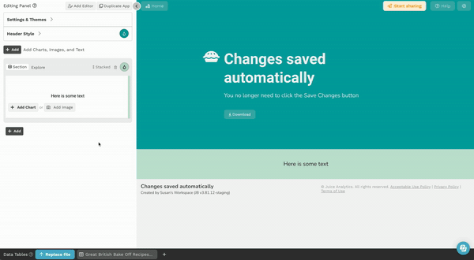

### 🐛 Bug fixes & other improvements

* In the filter slice, you can now filter on a range of values in a number column.
* Custom color themes are now easier to update.

## April 20, 2022

### 🎁 What's new?

* 📣 Introducing our newest chart type — **Pie charts!** 🥧\
  \
  Confession time: Over the years, we've sidestepped the Great Pie Chart Controversy (Really? [Yes](http://www.perceptualedge.com/articles/08-21-07.pdf). [Oh yes](https://www.storytellingwithdata.com/blog/2011/07/death-to-pie-charts).) by not offering a pie chart. But not anymore! Our pie chart is beautiful, simple to make, and automatically avoids those perilous pie-chart pitfalls. It's the right chart for showing parts of a whole, and we think you'll love it. Give it a try!

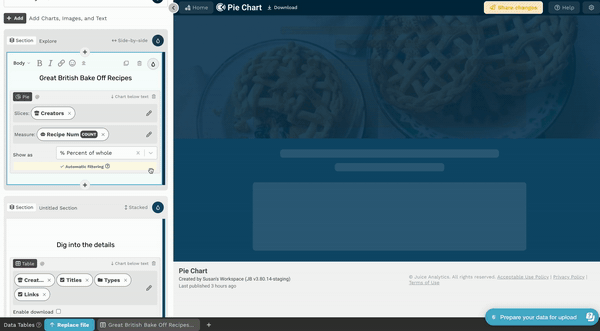

### 🐛 Bug fixes & other improvements

* Would you like to embed a Juicebox app in your own website? Just paste in the public app [embed code](building-reports/publish-and-share/sharing-and-access-controls.md#embedding-a-public-app).
* Trend charts are working again for measures with solely negative values.

## April 6, 2022

### 🎁 What's new?

* You can now export an app as either a PDF or PNG file. Just look for the **Download** button in the app header or header bar.

### 🐛 Bug fixes & other improvements

* You can create a Count measure using a boolean column. That used to be False, but now it's True.
* Dynamic text that references selections in the filter slice is working.

## March 10, 2022

### 🎁 What's new?

* Four new font themes give you more options for setting the tone of your app.
* Four new color themes add both dark and light palettes.

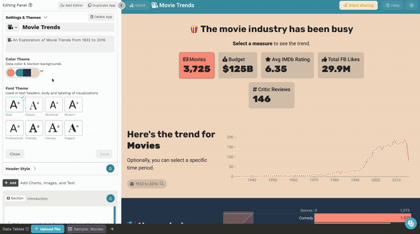

### 🐛 Bug fixes & other improvements

* Selections made for one filter pill in the Filter slice now filter across all other filter pills, so you don't have to worry about the order of columns. Filtering performance has improved too.
* Did you know you can duplicate an app? The **Duplicate App** button is now at the top of the editing panel to make that more findable.
* Higher numbers are often better (🏀), but not always (⛳️). A new [advanced measure](/broken/pages/-M9V4XsmNAG9oiSOl5fk) option lets you tell Juicebox when a lower measure value is better, so that the Leaderboard chart shows who's really on top.

## February 11, 2022

### 🎁 What's new?

Ok, y'all. This is a big one. Like, **the biggest update we've ever done**. In this release, we're finishing our journey to remove the editing tabs in the editing panel on the left of the workspace. Some really important things are moving around ("_where's my data??_" and "_so... how do I share now?_" might be questions you'll ask). So, take a moment to review the highlights:

* The **Data Drawer** replaces the Data tab
  * We've moved the Data tab to a drawer at the bottom of the window so you can easily see your data while you work. This gives you a clearer view of all your data and lets you switch between them more easily.
  * You can update your data using the easier-to-find **Replace file** button
  * A nice bonus: Now you can Download data tables making collaborating with other Editors easier than ever
* The **Sharing** button replaces the Share tab
  * We've moved the Sharing tab to a button in the upper right of the window that is always present, regardless of what you're doing in the editor. Now, you can quickly save and share your work with the click of a button.

### 🐛 Bug fixes & other improvements

* Leaderboard charts now have a bold new look. _Really_ bold.
* Leaderboard, Trend, and Map charts now use colors that are based on the color theme.
* A newly designed Resource Center (in the bottom right of the window) and videos help you get the most out of Juicebox.
* Column and measure pills have a new, cleaner look and are easier to remove from charts.
* For apps with multiple data tables, a new chart configuration option lets you choose which data table to use in the chart.

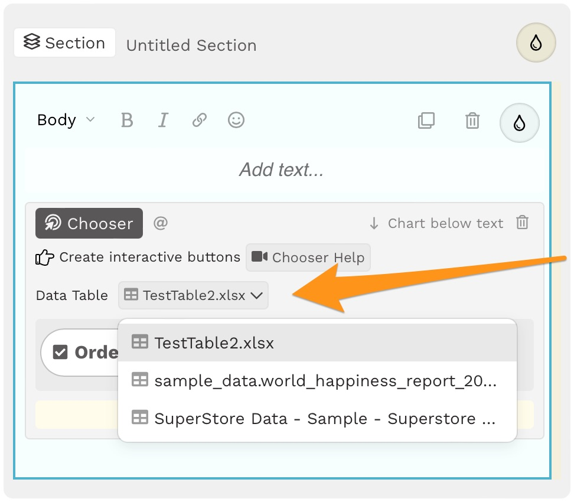

## December 8, 2021

### 🎁 What's new?

* **Add images to the background of your header and sections**. Take your data story style to the next level by adding background images to headers and sections. You can add your own images or find images on Unsplash.

 (1) (1) (1) (1) (1) (1) (1) (1) (1) (1).png>)

* **Streamlined data prep**. We've added lots of smarts to our data loading process so you can spend less time on data prep, more time telling your data story.

### 🐛 Bug fixes & other improvements

* New editing panel improvements help you get to the right place.
* Charts no longer allow configuration if data has not been loaded.

## October 19, 2021

### 🎁 What's new?

* **Easier color makeovers.** Quickly see how your app looks in a whole new wardrobe. Themed color palettes make it easy to change the look of your app in one click.

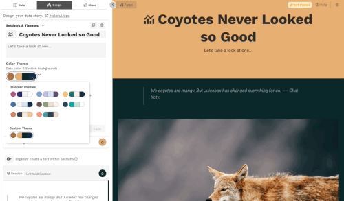

* **Easier to use data**. Now you can use all of your data columns as either dimensions or measures in charts. And you can decide how you want to calculate measures as you're adding charts to your story.

### 🐛 Bug fixes & other improvements

* A simpler way to create locations while making a map.
* Selections in table charts now filter properly (i.e., based on all columns, not just the first one).
* Improved performance for paginated charts.
* Deleting or duplicating apps, sections, and slices is easier with new  and  buttons.
* Broken ingredients are (mostly) a thing of the past.
* Improvements to data loading workflow.

## September 28, 2021

### 🎁 What's new?

* **Templates added to the&#x20;**_**+Create New**_**&#x20;app workflow**. We've incorporated templates of some of our best Juice-approved app designs into the workflow where you create a new app. These templates include full apps, and singular (but sweetly styled) charts that you can pick from. You can also add complete example apps to your workspace to use as inspiration and reference. Now, that data report idea you have can get the Juice-approved kick start you've been looking for.

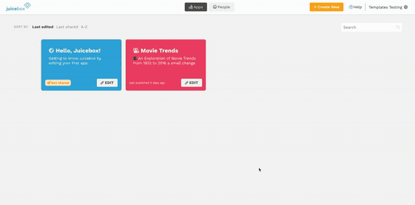

### 🐛 Bug fixes & other improvements

* The map can display locations even if no measures have been selected.
* Option to skip app setup details. If you want to accept the defaults and open your new app quickly, you can select **Skip Setup** in the app creation wizard.
* Loading data from Excel files has been improved.
* Other reliability and operational improvements.

## September 7, 2021

### 🎁 What's new?

* **Choosers have a new look.** Chooser buttons are now sized based on their content and have a more eye-catching appearance.

.png>)

* **Support for private editing notes.** Now you can leave notes in apps for yourself and other editors that won't be seen by your users.

### 🐛 Bug fixes & other improvements

* Public app links shared on Facebook and Slack look better.
* Dynamic text can now be copied using the slice "@" button and pasted into the text of a downstream slice.
* Added Excel files (.xls and .xlsx) to data upload options (for now this defaults to loading only the first Excel tab).
* Other improvements to the Design tab to make adding and configuring slices easier.

## August 13, 2021

### 🎁 What's new?

* **More ways to style text.** And now, with even _more_ style! You can add numbered lists, bulleted lists, and block quotes. The text in your editor panel now looks more like it _actually_ does in your app.

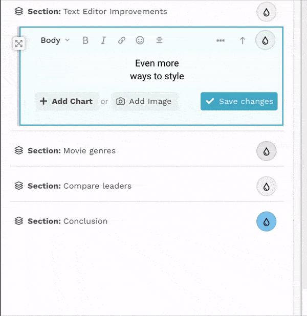

* **Less ingredient clutter.** A big, unorganized pile of ingredients makes it hard to cook—and hard to build your Juicebox app. The new tidy _and separate_ columns for measures and dimensions mean there's less clutter with your ingredients. _Bon appétit_! 🍱

### 🐛 Bug fixes & other improvements

* Adding charts is quicker and easier.
* Improved trend legends.
* Backend synchronization has been improved.

## July 26, 2021

### 🎁 What's new?

* **✨New text editor✨** With our new text editor, you can add and style text, emojis 🔥, and links with ease. Huzzah! (But if you still want to get down with Markdown, you can do that too.)
* **Multi-line trend.** Now you can show up to 5 measures in a single trend chart. Compare to a target or a moving average (or both!) and bring context and clarity to changes over time. And if you want dual vertical axes, you can do that too.

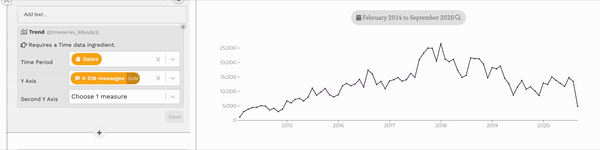

* **Custom subdomains**. Is your cute-and-fruity workspace subdomain a little _too_ cute for your needs? Now you can customize your subdomain in the new Settings page. (Requires a Team plan subscription.)
* **Team plan goodies**. Sign up for the Team plan and get access to more users, bigger uploads, a custom subdomain, and more.

### 🐛 Bug fixes & other improvements

* Simplified sharing.
* The list of charts you can add to a slice was being cut off. That's fixed now.
* Even more improvements to data loading.

## July 6, 2021

### 🎁 What's new?

* **Header styles.** We've added three pre-formatted options for your app's header: small, medium, and large. Feeling bold? You can turn those off and do your own thing. _Vive la différence!_

### 🐛 Bug fixes & other improvements

* The Help menu now has links to Documentation, Help articles, and other resources.
* "Automagically" adding ingredients now adds a time ingredient for year columns.
* Improved data loading now catches even more issues (so you don't have to).

## June 15, 2021

### 🎁 What's new?

* **Easy-to-add images**. Juicebox's new image upload capability lets you easily add images to your Juicebox app -- no more cryptic code. And, you can make an even bigger splash with the [Unsplash ](https://unsplash.com/)integration. Now, go image like a pro 📸.

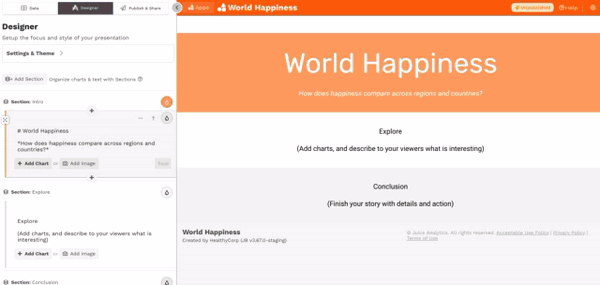

* **Add a chart even if you don't have data.** No data? No problem! Now when you click "Add a Chart" and select a chart type, you'll see an example of that chart in your app. Even if you don't yet have all the data that chart requires, it will still display _and_ be interactive. So, now you can build your data story and _then_ go find the data that tells your story. That's one more blocker to frictionless storytelling _eliminated!_ 🥊

### 🐛 Bug fixes & other improvements

* An improved Designer tab in the editing panel.
* Smarter data loading, particularly for European file formats.
* More performance and bug fixes.

## May 24, 2021

### 🎁 What's new?

* **A redesigned Apps page**. The apps page is that special place you keep all your creations. So we decided to give it some love and add features that it’s been deserving:
  * **Sort your apps** — Sort the apps in your workspace based on _date edited_, _date published_, and (of course) _alphabetically._
  * **Search your apps** — Find that app you created by searching for text in the title and description.
  * **Know your apps** — Finally, more information about app publish status is on the apps page.
  * **😍 your apps** — The app layout is more beautiful. Oh yeah, and it uses less space. _A lot_ less.

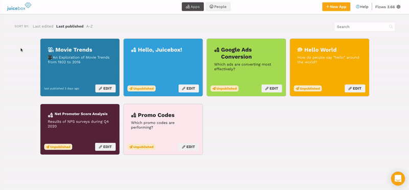

* **Simplified Editor Tabs** — The options in the Settings tab have been moved into the Designer tab of the Editing Panel to help keep everything simple. So, from now on, that's where you'll be setting the Settings settings.

### 🐛 Bug fixes & other improvements

* 🕵️‍♀️Better recognition of the delimiter that is used in CSV files.
* A profile popup to change your name or your password.
* More performance and bug fixes.

## April 30, 2021

### 🎁 What's new?

* ✨**Drag and drop data loading**: The Data tab in the editor gets you where you need to go with fewer clicks. You can 🐉drag-n-drop CSV files to create new data sources or replace data in an existing data source.

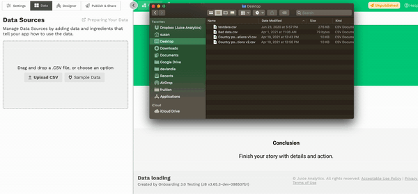

### 🐛 Bug fixes & other improvements

* 💅Layout and usability improvements to the Story Designer
* ⚗️Adding ingredients "automagically" is easier and quicker
* ⌨️ Improved keyboard navigation.
* More performance and bug fixes.

## April 12, 2021

### 🎁 What's new?

* **Easier sign in**. If you've ever created a workspace only to realize you don't quite remember how to get back to that space, you know how low that can make you feel. But, those day of scrounging around for the right URL are gone! Now, you can just point your browser to [myjuicebox.io](https://www.myjuicebox.io) and sign in there -- you'll be ushered right to your space, just like the celeb you are. (Oh yeah, and if you have multiple workspaces, you'll be able to pick the one you want -- all from [myjuicebox.io](https://www.myjuicebox.io).)

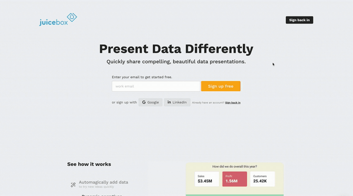

* **Sample data**. We've brought some interesting sample data sets to Juicebox so you can start making presentations without hunting for a clean CSV.

### 🐛 Bug fixes & other improvements

* 💅Layout, formatting and tooltip improvements. Great data presentations are more than a pretty face, but prettier doesn't hurt.
* 📈+📉The trend chart now properly displays negative numbers.
* 🏎️ More performance and bug fixes. Vroom, vrroooom!

## February 25, 2021

### 🎁 What's new?

* ✉️ **Invite editors to your workspace**. Now you can add editors to your workspace team more quickly by sharing invite links or sending invitation emails from either the People page or from the Publish & Share section of an app.

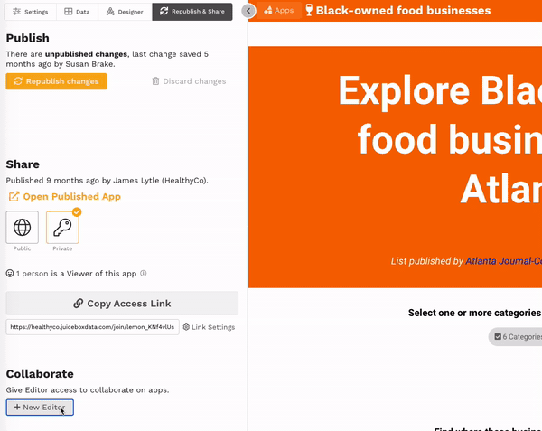

* 🕵️‍♀️ **Find your folks**. The new search bar in the People page lets you find and manage users even more easily.

### 🐛 Bug fixes & other improvements

* ➕ When you create a new app, you'll go directly to the Data Sources section in that app.
* 🎨 When you open an existing app, you'll go directly to the Story Designer section in that app.
* 🔢 More data about your data. The data preview now shows you when you last loaded your data and the total number of records.
* 📱 Editors can now _view_ both published and draft apps when on a phone.
* More performance and bug fixes.

## January 18, 2021

### 🎁 What's new?

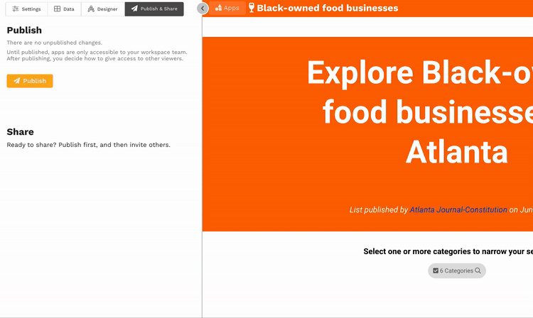

* **Better control of who can see what.** Owners and Admins have a new [People page](managing-users/user-management-and-roles.md#managing-users) to see who is using your apps. Friend your friends:smiling\_face\_with\_3\_hearts:; change user roles:fist:; control app access:closed\_lock\_with\_key:; unfriend your enemies:unamused:.

### 🐛 Bug fixes & other improvements

* Even more chart layout improvements.
* Faster app and new workspace creation.
* Lots more performance and bug fixes.

## December 16, 2020

### 🎁 What's new?

* **Sign up for a workspace.** Now you (and all your friends) can [create your own workspace](getting-started/new-workspace.md). Why would you want your own workspace? Perhaps you want to do some data presentation work for that non-profit you're helping out with. Or maybe you have an idea for a data reporting side-gig. Whatever data-prez itch you have, now you can create a separate workspace to put it in. _Juicebox all-the-things!_
* **Duplicate an app.** If you want to create a new app that is similar to an existing app, you can [duplicate it](/broken/pages/-M4yTgyq-sgYGM-Vmnn-#duplicating-an-app).

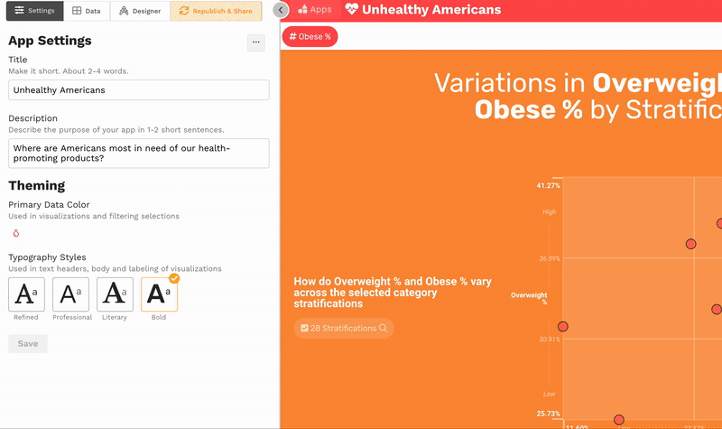

* **New footer.**��Your app footer now shows the name of the app, when it was last published, the Juicebox version, and all the legal stuff. No more wondering if your Juicebox is up to date.

### 🐛 Bug fixes & other improvements

* More polished loading of the apps page and app editor.
* Publishing apps should be celebrated - and now it is! 🎉
* Improved chart layouts.
* Access links shared on Facebook and LinkedIn are more inviting.
* Database connections to Redshift, Snowflake, Postgres, SQL Server, and MySQL are now supported.
* Many, _many_ other things to make Juicebox even better.

## October 29, 2020

### 🎁 What's new?

* **Editable section names** - Now you can rename your old, confusing [section](/broken/pages/-M29d5mhzv0eZdJT1pzO#add-a-section) names, like _group\_a8fwcyke,_ to something less confusing like _Rumpelstiltskin_. Or something. This will make them memorable _and_ useful. And don't forget you can collapse and organize your sections to bring more clarity to your data story.

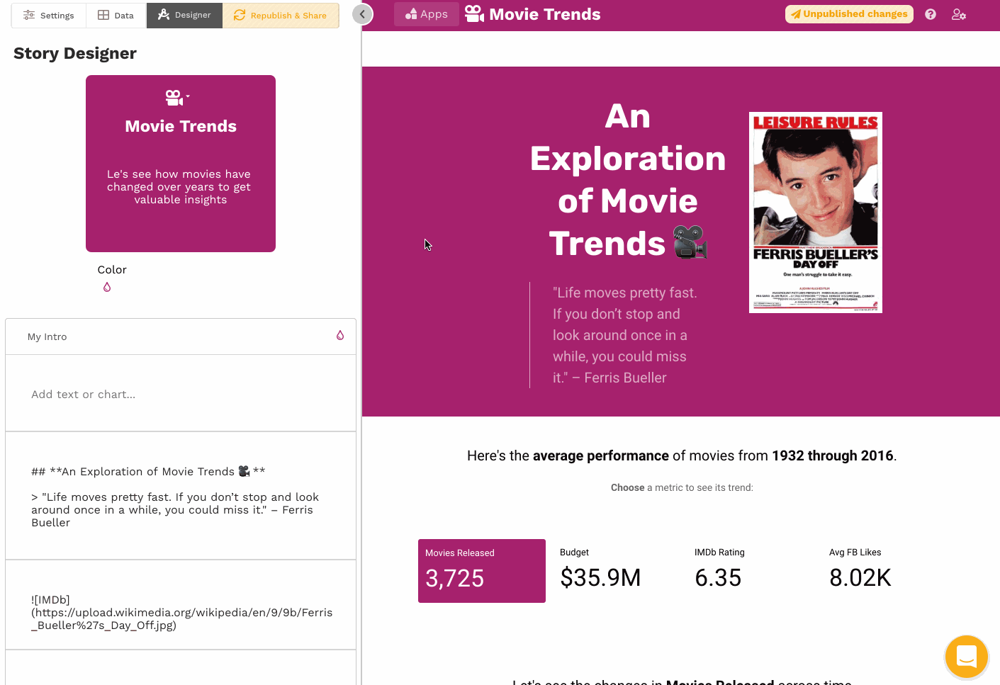

* **Support for database connections** - Do you want to add a [data source](building-reports/data-sources/loading-data/) from a Redshift or Snowflake database? That's now possible! To get started, send us a message by clicking the chat button below.

### 🐛 Bug fixes & other improvements

* **Numerous slice layout improvements** - Whether you are mixing[ text styles](building-reports/story-designer/slices/#adding-text) or combining slices in [horizontal section layouts](/broken/pages/-M29d5mhzv0eZdJT1pzO#section-layouts), everything looks:ok\_hand:.
* **Ingredients are easier to find** - In the ingredient pill, measures now show their aggregation, and advanced ingredients get a cute, new calculator icon. Less sleuthing, more finding. 🔎
* **Trend labeling cleaned up** - The x-axis has been improved so that it shows appropriate labels based on the length of time and aggregation. 📈
* Various Story Designer improvements. After all who doesn't like a better story?
* Various performance and bug fixes. A variety of faster, and an anti-variety of broke.

## October 10, 2020

### 🎁 What's new?

* **Automagic color contrast** - Don't be afraid of the dark! **🎃**Now, when you change the background of your slices to a dark color, the slice will automatically invert other colors so that it remains readable. It's a beautiful way to draw attention to the highlights of your data story!

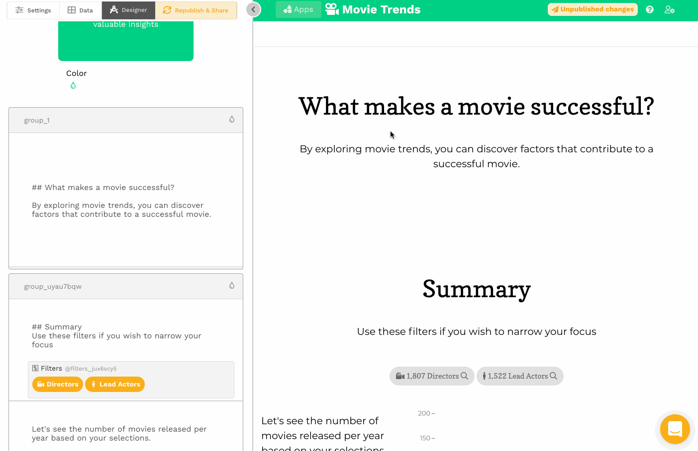

* **Easier to find your way home** 🏠 - To get back to the apps page, just click the Apps button in the header of any app. It's a little like Little Red Riding Hood... but without the wolf.

### 🐛 Bug fixes & other improvements

* **Faster loading apps**: Apps built with uploaded CSVs now get faster the more you use them thanks to the magic of enhanced caching. Nobody likes waiting. Now there's less of it.
* **Better labels**: Ok, we know that in some situations, labeling in the [scatterplot chart](building-reports/story-designer/slices/charts/scatterplot.md) was well... broken. 🤕It's better now. Boo-boo all gone.
* **Bar charts use bucket order:** [Bar charts](building-reports/story-designer/slices/charts/bar.md) that use [bucketed dimensions](/broken/pages/-M9TXR6V3QjmXtXZUSe6) will now show the buckets in the order you defined them. After all, can't we all use a little more order?
* **Map charts zoom out farther**: The [map chart](building-reports/story-designer/slices/charts/map.md) now lets you zoom out farther to get a global perspective. 🌍Next step: Mars. Maybe
* Various performance and bug fixes. Much perform. Un-bugged.

## September 17, 2020

### 🎁 What's new?

* **An improved trend chart** 📈 - We did a brain upgrade on the trend chart. The [trend chart](building-reports/story-designer/slices/charts/trend.md) is now smarter about handling dates and times. You can easily roll up dates by month or year (see time ingredient improvement below), see which dates are missing data, and select ranges of dates to filter the story below. Hey, Trend Chart: it's time you were schooled 🎓.

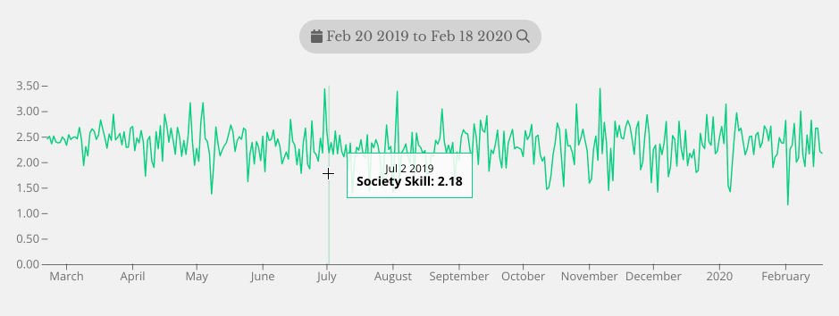

* **Broken ingredients** 🐣- Change is hard, we know that. When you replace a CSV on a data source, sometimes the new data has different names or different data types. This can break data ingredients. You'll see these [broken ingredients](building-reports/data-sources/managing-data.md#fixing-broken-ingredients-caused-by-changes-in-column-names) highlighted (in a style we call "the blushing zebra") so you can fix them. Now change isn't so hard.

### 🐛 Bug fixes & other improvements

* **Roll up time ingredients by month or year**: You can easily roll up time ingredient dates by month or year by choosing a month or year format when [defining the time ingredient](/broken/pages/-M2oH46TBtoR6EcAo298#time-ingredient). It's time to roll ⏰.
* **New advanced ingredient functions:** There are new options for advanced aggregations. You can calculate [percentiles and ages](building-reports/story-designer/ingredients/advanced-formulas.md#aggregation-functions). This improvement is in the top percentile.
* **More docs on formatting:** The advanced ingredients docs now contains lots of examples of how to build [custom number formats](/broken/pages/-M9TZ8szTE19iRrqkwhu#advanced-number-formats). `,.0f" days until Christmas"` might not mean anything to you, but it does to Juicebox. And to Santa. 🎁
* Various performance and bug fixes.

## August 27, 2020

### 🎁What's new?

#### Share your app via a 🔗 link

Invite anyone to create an account and view your app by simply [sharing your access link](building-reports/publish-and-share/sharing-and-access-controls.md). ​

#### +New sign in with your existing account

[Sign in](viewing-apps/signing-in.md) or with Google, LinkedIn, or your email address.

​​

### 🐛Bug fixes & other improvements

* **A better new-app template** - Now, when you make a fresh new app, you'll get a nice template with a header, intro, and sections to fill in to make your data story even more envied by your coworkers.
* **Automagically add your data**🎩- When you add a Data Source to an app, press the "[Add Automagically](/broken/pages/-M2oH46TBtoR6EcAo298#adding-ingredients-automagically)" button to tell Juicebox which data columns you're most interested in.
* **Story designer slice card improvements** - Added emphasis to the "Save" button, added nice hovering touches, and cleaned some dusty corners.
* **No more "null island" ☠️🏝** - The map chart no longer displays Place dimension values where the latitude or longitude are missing (null) or are exactly 0,0 (the location of what we affectionately call null island in the middle of the Atlantic Ocean. We're guessing that's not the location you really wanted 💀).
* **Table slice column headers now resize** - The table chart no longer cuts off multi-line column headers. Instead, the column header will resize to fit. Nobody likes being squeezed into something that's too small.
* Various performance and bug fixes.

## August 6, 2020

### 🎁What's New?

* **Date improvements** 📅- New Data Ingredients options let you [group dates](building-reports/story-designer/ingredients/advanced-formulas.md#conversion-functions) by week, month, quarter or year.

### 🐛Bug Fixes & Other improvements

* Sharing is caring🔨- Lots of behind the scenes work to let you share your data stories.
* Juicebox is more outgoing and informative if there's an issue uploading data.
* Various infrastructure, error handling and warning improvements.

## July 16, 2020

### 🎁What's new?

* **Replace CSV** 🎉- Updating your data just got 💯better. Opening any existing CSV data source now gives you an option to replace its data.
* **Chat support** 🗣- Get quick access to docs and a place to ask your burning questions. Just click the "?" button in the top right to get started.

### 🐛Bug fixes & other improvements

* Side panel measure formatting didn't work in some cases. We've ironed that out.
* Various data error handling and warning improvements.
