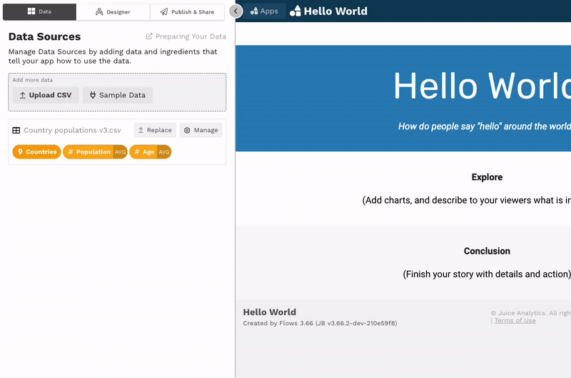

# Adding ingredients

There are two steps to adding a data source: 

1. upload or connect to your data
2. add your data ingredients

This section covers the second step.  \(The first step is covered [here](../loading-data.md).\)

After loading data, you're ready to add data ingredients. Data ingredients are the basic building blocks for every chart in your app. So before you can add charts to your app, you'll need ingredients. 

There are three ways to add ingredients: add ingredients "automagically", add ingredients manually one at a time, or duplicate existing ingredients. You can use any or all of the three methods to create the ingredients you need for your data story. 

After uploading or connecting to your data, decide how to add your ingredients.


## Adding ingredients "automagically"

Adding ingredients "automagically" allows you to quickly add ingredients so you can dive into designing your story. To add ingredients automagically, select the **Automagically** button. Juicebox will inspect the  fields in your data and create an ingredient for each based on its best guess, according to these rules:

* If the field contains only numeric values, a [**measure**](./#measure-ingredient) ingredient will be created.
* If the field contains only date values, a [**time**](./#time-ingredient) **** ingredient will be created.
* If the field contains a numeric values that appear to be years, both a measure ingredient and a time ingredient will be created. 
* If the field contains values other than numeric or date values, a [**dimension**](./#dimension-ingredient) ingredient will be created. 

The automagically added ingredients are just a starting point. You can revise them later using the [**ingredient editor**](./#ingredient-editor).  



## Adding ingredients manually

Sometimes the ingredients created through the automagic method will not be what you need. To have more control over ingredient definitions, you can add ingredients manually by selecting the **Manually** button \(which will open the the [data preview](./#the-data-preview)\) or select the **Manage** button next to the data source to open the data preview. From there,

1. click the **+** next to the field you want to use in the new ingredient
2. select the type of ingredient you want to create from the available options
3. define the ingredient in the [ingredient editor](./#ingredient-editor)



### The data preview

Adding ingredients manually is done  from the **data preview**. The data preview will show a sample of your data records. 


To open the data preview, click the **Manage** button next to the data source. 


 To exit the data preview, simply click outside of the data preview window. 

### Ingredient editor

The **ingredient editor** is a form that you fill out to define your ingredient. The form varies somewhat by type of ingredient because different ingredient types require somewhat different [components](ingredient-components.md). 

To access the ingredient editor for an existing ingredient, click on the ingredient pill. You can click on an ingredient pill in either the Data  or Design sections of the editing panel.



Below are examples of the ingredient editor for the different ingredient types \(dimension, place, time, and measure\) as well as the underlying components for each ingredient.

### Dimension Ingredient

A dimension is an ingredient that is used to define a group of data records. Students, states, and years are all examples of dimensions. Here is an example of a dimension labeled `Countries` :


And here are the underlying [components](ingredient-components.md):

```text
kind: Dimension
field: country
singular: Country
plural: Countries
icon: check-square
```

### Place Ingredient

A place ingredient is a special kind of dimension ingredient that has an associated geographic location \(i.e., latitude and longitude\). A place ingredient is required by the [map](../../story-designer/charts/map.md) chart. Here is an example of a place ingredient labeled `Countries` :


And here are the underlying [components](ingredient-components.md):

```text
kind: Dimension
field: country
singular: Country
plural: Countries
icon: map-marker-alt
latitude_field: latitude
longitude_field: longitude
```


This Help Center [article](https://help.myjuicebox.io/en/articles/5152187-adding-a-place-ingredient) walks you through how to create a place ingredient.  The latitude and longitude fields in your data must be numbers, not strings. In other words, your latitudes should look like `38.8977` rather than `38.8977° N`. Likewise, your longitudes should look like `-77.0365`, rather than `77.0365° W`.


### Time Ingredient

A time ingredient is a special kind of dimension ingredient that uses a date or timestamp field. A time ingredient is required by the [trend](../../story-designer/charts/trend.md) chart. Here is an example of a time ingredient labeled `Years` :


And here are the underlying [components](ingredient-components.md):

```text
kind: Dimension
field: Year
singular: Year
plural: Years
icon: calendar
format: '%B %-d, %Y'
```

Time ingredients are automatically created from date or timestamp fields in your data, so long as the fields are [formatted properly](../../design-tips/preparing-your-data.md). 


If you have a field with years in your data, you will need to format them like `2020-01-01` or `01-01-2020` rather than `2020`. 



Time ingredients will "roll up" to the period selected for the `format`component. For example, selecting the `month yyyy` format will roll up to the month. Selecting the `yyyy` format will roll up to the year. 


### Measure Ingredient

A measure is a value calculated over a group of data records. Average sales, student count, and maximum price are all examples of measures. Here is an example of a measure labeled `Avg Profit` :


And here are the underlying [components](ingredient-components.md):

```text
kind: Measure
field: avg(Profit)
format: .3s
singular: Avg Profit
icon: sack-dollar
```

#### Advanced Ingredient

If the options available in the ingredient editor are not sufficient to define your desired ingredient, you will need to add an [advanced ingredient](../advanced-ingredients/). 

## Duplicating an existing ingredient from within the ingredient editor

You can add a new ingredient by duplicating an existing ingredient. To do this, open the ingredient editor for the ingredient you want to duplicate. From there, select the menu icon \(\) and select **Duplicate**.


This will duplicate the ingredient and open the ingredient editor for the duplicated ingredient. Revise the ingredient definition as needed and save.



You cannot convert from one ingredient type to another. For example, you cannot create a place dimension ingredient from a measure ingredient. Therefore, the ingredient you select for duplication will need to have the desired ingredient type. Alternatively, you can add a new ingredient of the desired type using [this method](./#adding-ingredients-one-at-a-time). 


