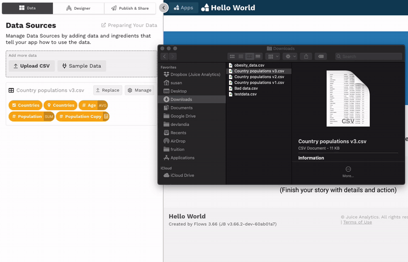

# Managing data sources

## Replace data

From time to time, you may want to update the data for a data source. For example, you may want to correct data in existing rows, add or remove rows, or add or remove columns. 

To do this, either drag the new CSV onto the data source—

—or click the **Replace** button next to the data source or in the [data preview](adding-ingredients/#the-data-preview) and select the new CSV.

Once the upload process finishes, refresh the page. The app will then display the updated data. 


It is good practice to publish before replacing data. That way if you select the wrong CSV \(or something else goes wrong\), you can revert back to where things were before doing the replace.



The Replace functionality only updates the data underlying the data source. It does not update the name of the data source or the data ingredient definitions. 


### Fixing "broken ingredients"

After replacing data, some of your ingredients may display as pink, striped pills. This indicates that the ingredients are broken. 

So long as the column names and types in the new CSV are the same as in the old CSV, the ingredients should not break. But if the column names or types have changed, you will need to fix the ingredient definitions.  

For example, suppose you have a `Student Name` dimension ingredient that points to the `student_name` field. Later, you replace the original data with a CSV that has column `studentname`, instead of `student_name`. Your app will display a "Couldn't get the data" message for any slices that use the `Student Name` ingredient because that ingredient is pointing to a field that no longer exists in the data. In other words, the `Student Name` ingredient is broken. To fix the ingredient, click on the `Student Name` ingredient pill and select the updated field name `studentname` from the dropdown. 


If you see the "Couldn't get the data" error message in your app, this means there is one or more broken ingredients being used in your app. To locate the broken ingredients, go to the slice in the Design section of the editing panel where you first see "Couldn't get the data" instead of the expected chart. This is the slice that has the first broken ingredient. In many cases, the broken ingredients will display with red highlighting and stripes. After identifying and fixing the broken ingredient, reload the page. Continue this process \(finding the slice with the first "Couldn't get the data" message, identifying the broken ingredient, and fixing the broken ingredient\), until the entire app loads without error. 


## Update ingredient definitions

To make a change to an ingredient definition, click on the ingredient pill in either the Data or Design sections of the editing panel. This will open up the ingredient editor.  From there, make the desired changes to the ingredient. Keep in mind that some changes may require that you [add an advanced ingredient](advanced-ingredients/).

## Delete a data source

If you have a data source that you don't plan to use in your app, you may want to delete the data source to declutter the Data Sources section of the editing panel. To do this, open the [data preview](loading-data.md#the-data-preview) for the data source you want to delete and select the  button, then select **Yes, delete it**. 


You will receive a warning message if the data source ingredients are used in your app. In general, you should not delete a data source that is being used by an app. Doing so will cause all ingredients from the data source to break, i.e., become "broken ingredients." 


