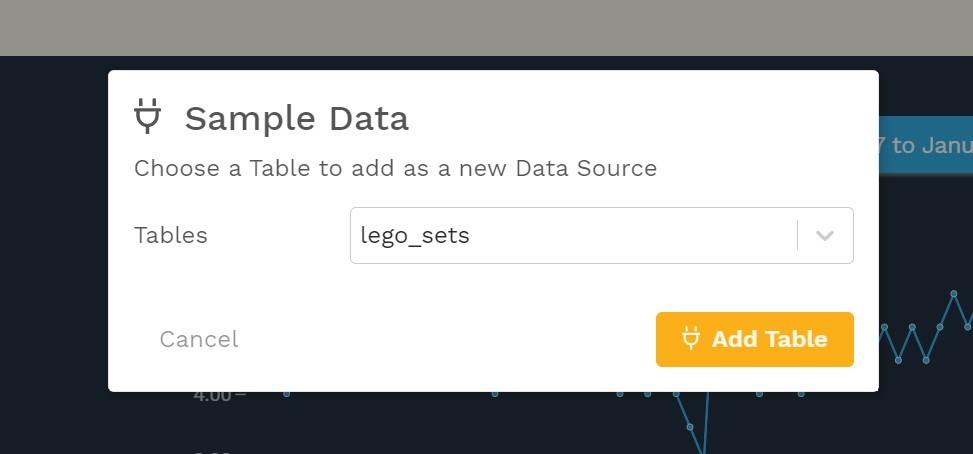

# Loading data

There are two steps to adding a data source: 

1. upload or connect to your data
2. add your data ingredients

This section covers the first step. \(The second step is covered [here](adding-ingredients/).\) You can upload a CSV or, in a future release, connect to a database table or view or a Google Sheet.

## Upload a CSV

To upload a CSV, navigate to the **Data** section of the editing panel and drag a CSV into the data source box or click **Upload CSV** and  select the CSV file to be uploaded.


When using CSVs, it is important that your data be nice and clean. Here are some tips for [preparing your data](../design-tips/preparing-your-data.md). 




## Connect to Sample Data

Juicebox also provides a selection of sample data tables if you want to start exploring before you have your own data. To load sample data, select the **Sample Data** button and choose one of the available datasets. 

Choose a table to get started and select **Add Table**.

The sample data includes the following tables. 

| Sample Data | Description |
| :--- | :--- |
| lego\_sets |  **🎛 LEGO sets** \([CSV download](https://docs.google.com/spreadsheets/d/10lJ-WWUvI8A1ezdzK0NWvGp5hjKT73Nj2N9eccLQIqY/export?format=csv&gid=0) or see the data in a [Google Sheet](https://docs.google.com/spreadsheets/d/10lJ-WWUvI8A1ezdzK0NWvGp5hjKT73Nj2N9eccLQIqY/edit#gid=0)\). Source: [Kaggle](https://www.kaggle.com/mterzolo/lego-sets) |
| movie\_trends |  **🎬 Movie Trends** \([CSV download](https://docs.google.com/spreadsheets/d/1FyPKMdoHskUyDLJzo66fq5LBZxwIcot-JWGakXz9D_o/export?format=csv) or see the data in a [Google Sheet](https://docs.google.com/spreadsheets/d/1FyPKMdoHskUyDLJzo66fq5LBZxwIcot-JWGakXz9D_o/)\). Source: [Kaggle](https://www.kaggle.com/) |
| olympic\_medals |  **🥇Olympic Medals 1896-2012** \([CSV download](https://docs.google.com/spreadsheets/d/1t5VH3Psl2O-ooo8vYPLkDplIWvUiYcQNeyJzVyiun98/export?format=csv&gid=0) or see the data in a [Google Sheet](https://docs.google.com/spreadsheets/d/1t5VH3Psl2O-ooo8vYPLkDplIWvUiYcQNeyJzVyiun98/edit#gid=0)\). Source: International Olympic Committee, The Guardian Datablog, and [Kaggle](https://www.kaggle.com/the-guardian/olympic-games) |
| video\_game\_sales |  **🎮 Video Game Sales** \([CSV download](https://docs.google.com/spreadsheets/d/1HGTdSQF62dQMwyTCq71XcN5lO4cI9WzNIRthT1Uh_eE/export?format=csv) or see the data in a [Google Sheet](https://docs.google.com/spreadsheets/d/1HGTdSQF62dQMwyTCq71XcN5lO4cI9WzNIRthT1Uh_eE)\). Source: [Kaggle](https://www.kaggle.com/gregorut/videogamesales). A helpful getting started [article and video](https://intercom.help/juiceboxdata/en/articles/4720121-simple-apps-dynamic-bar-chart-and-table) to create a dynamic bar chart. |
| world\_happiness\_report\_2020 | **😀 World Happiness Report 2020** \([CSV download](https://docs.google.com/spreadsheets/d/1UuRe1YL79gi8eeNDBM_oHMFiXUDvw4F2IJ6p9SNtZXI/export?format=csv&gid=6513579) or see the data in a [Google Sheet](https://docs.google.com/spreadsheets/d/1UuRe1YL79gi8eeNDBM_oHMFiXUDvw4F2IJ6p9SNtZXI/edit#gid=6513579)\). Source: [World Happiness Report](https://worldhappiness.report/ed/2020/) and [Data.World](https://data.world/makeovermonday) |

If you want more ideas on data to start with, check out this [article](https://help.myjuicebox.io/en/articles/4346552-sample-data-to-get-started%20) in the Help Center.

## Connect to a database table

If your app is connected to a database, you can select the schema and table to use in the data source. If you are interested in connecting your app to a database, please reach out to us by clicking the chat button below. The following databases are supported:

* Redshift
* Snowflake
* Postgres
* SQL Server
* MySQL

## Next step: Adding ingredients

After loading your data, the next step is [adding ingredients](adding-ingredients/). 

