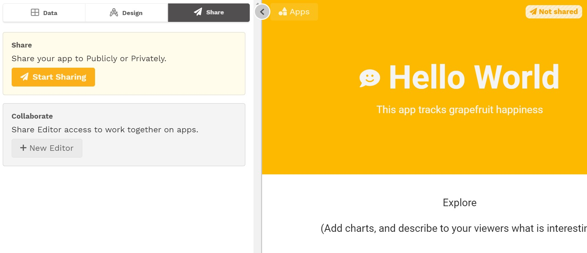
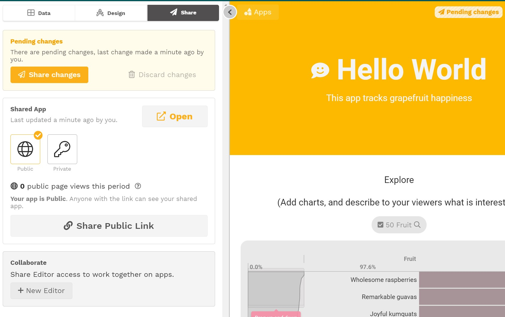
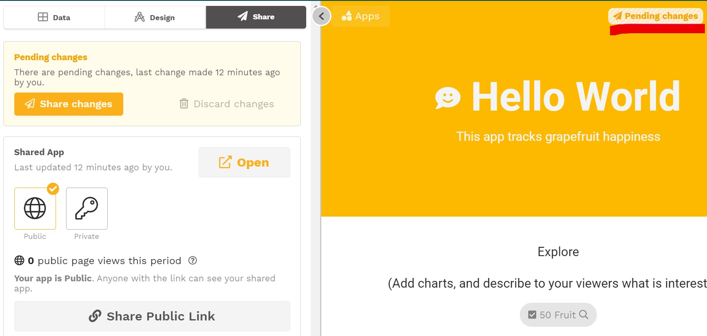
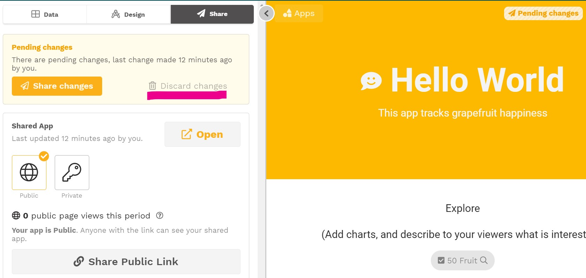

# Sharing changes to your app

## Sharing an app

Before you start sharing your app, only editors in your workspace will see the changes you've made. When you're ready for other to see your app, it's time to share your work with viewers.

### Sharing for the first time

To publish for the first time, go to Share in the editing panel and click **Start Sharing**.

Next, decide whether you want to share the app **publicly** or **privately**.

* A **public app** can be viewed by anyone with the app url. Viewers of public apps are not required to sign in and their app access cannot be managed. 
* A **private app** can be viewed only by those that have signed in with a Juicebox account that has access to the app. Viewer access to the app can be [managed in the People view](../../managing-users/user-management-and-roles.md).


If your app contains information that not everyone should see, you should publish it as a private app. If your app does not contain sensitive information, you may not know whether you want the app to be public or private. That's ok! Just select one and change it later as needed. 


After publishing, you are ready to [share your app](sharing-and-access-controls.md). 

### Handling changes after sharing

New changes made after you share will not be seen by viewers until you chose to share them. To share the newest changes, click **Share changes**.

## Making changes to an app

Until you share them, any changes you make to an app are only visible to editors. Viewers who have already been given access won't see your changes until you are ready to share them. With Juicebox, you can share, refine your app, share the new changes, refine some more, share the new changes, and so on. You can continually improve and experiment without affecting what viewers see.


**Edit freely** - you can always [discard changes](https://juicebox.gitbook.io/juicebox/authoring-apps/publish-and-share/publishing-app-changes#discard-changes-to-an-app), to return to the last version of the app that you shared with viewers.


The version  of the app that editors work on is called the **draft version**. All changes are saved to the draft version until they are shared, you do not have to keep track of whether you are working in the draft version. Here are indicators that you are in the draft version:

* You will see "draft" in the app url
* You will see the editing panel
* After first publishing:
  * If there are any unshared changes, the Share section's name be highlighted in yellow
  * You will see an "Pending changes" pill in the app header

## Discard changes to an app

At some point you may want to discard all the unshared changes in the draft version and go back to the previously shared version. To do this, go to the Share section and select **Discard changes**. 


Discarding changes will discard **all changes** made since the last share _**including changes**_ **to data sources.** 


