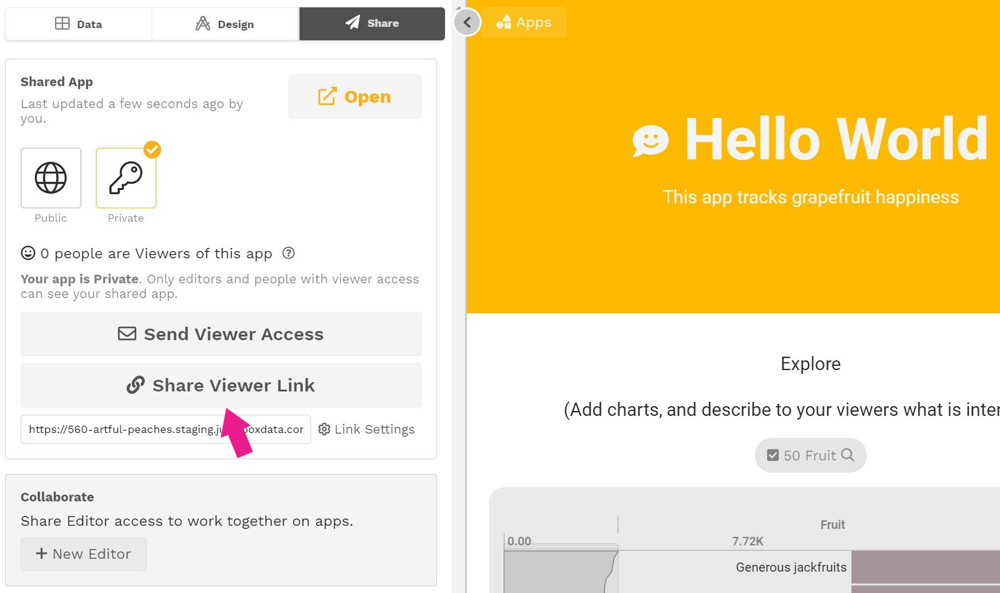
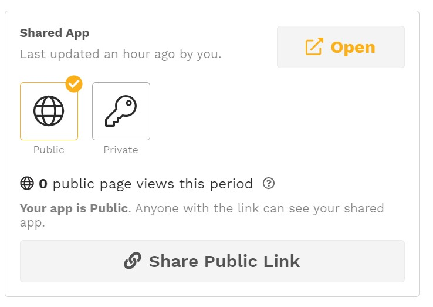

# Controlling sharing

After you share your app, it's time for others to view it! How this happens depends on whether you share the app publicly or privately.

## Sharing an app publicly

To share an app publicly, click the **Share Public Link** button to copy the app link and share the link as you would any other website link. Anyone who clicks on the link will see the published version of your app. 


You can also embed your public app into another website by putting the app link into an iframe on that website. 


## Sharing an app privately

To share an app privately, you share only with the people you want to see it.

### Sending Viewer Access

To share your app with specific people you can either email a viewer link to viewers you want to add or copy a multi-use viewer link and share it yourself.

* Navigate to the Share section of the editing panel
* Click **Send Viewer Access** to email the access link or click **Share Viewer Link** to copy the access link to your clipboard.

If you copy a viewer link, that link can be sent via email, text, social media, or any other means. The link can be used by multiple people and will remain usable until you [regenerate the link](sharing-and-access-controls.md#regenerate-link).  When a person clicks on the link, they will be asked to [sign in](../../viewing-apps/signing-in.md) to your Juicebox workspace to see the app. 

### Controlling Acces

#### Regenerating a viewer link

To prevent new users from accessing the app through a previously shared viewer link, you can regenerate the link. Any previously used links will no longer allow new users to sign up. Users that have already signed up will still be able to see the app. Their access can be managed through the [People view](../../managing-users/user-management-and-roles.md#managing-users). 

To regenerate the link, select **Link Settings** and then **Regenerate**. 

#### User email domain \(future release\)

In a future release, links will be able to limit access to only users with specific email domains. 

## Switching between public and private sharing

To change a public app to a private app, or vice versa, simply select the corresponding button. 

