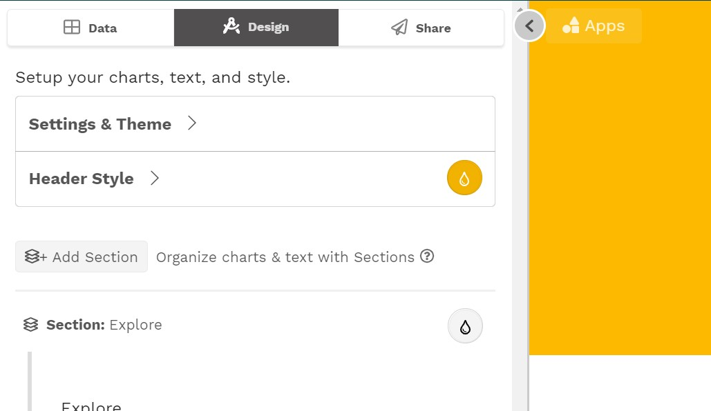

# Design

The **Design** section of the editing panel is where you design your data story. A story should be focused on a particular audience and purpose and gently guide users to the actionable insights they need. Within each story are sections, and within each section are slices. Each slice can have text and/or charts. 

Select the **Design** tab at the top of the editing panel to get started

There are several components you will be working with in the Design section. They are:

* Settings & Theme
* Header Style
* Sections
* Slices
* Charts

These components are described on the following pages:









