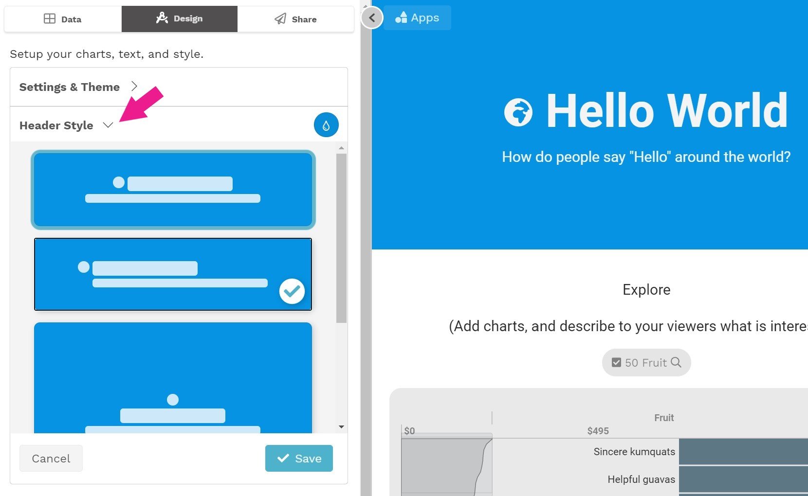

# Header Style

The Header Style section at the top of the Design tab is where you can quickly create and style an intro section for your app. 

To do this, first expand the  Header Style section. Select the header style and background color you want to apply, and then click **Save**. 

If you would like design your own header, rather than use one of the styles in the Header Style section, you can select the "No Header" option and then add one or more slices with your desired header elements  \(text, color, images, and/or charts\).

