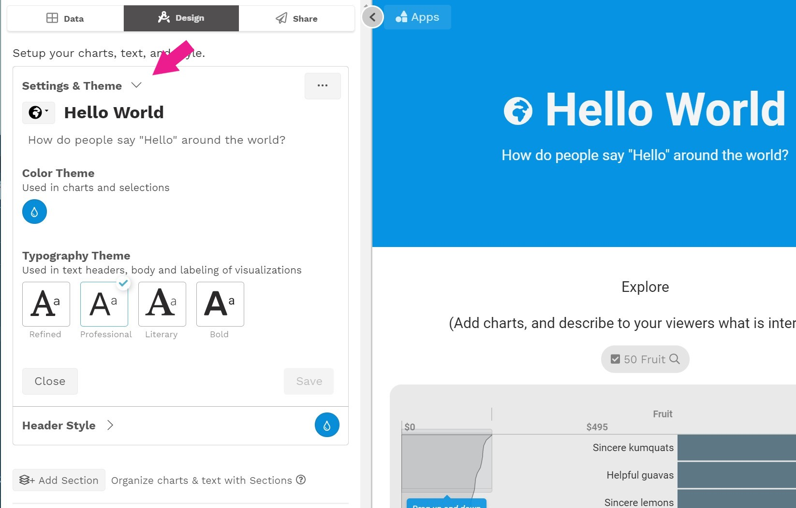
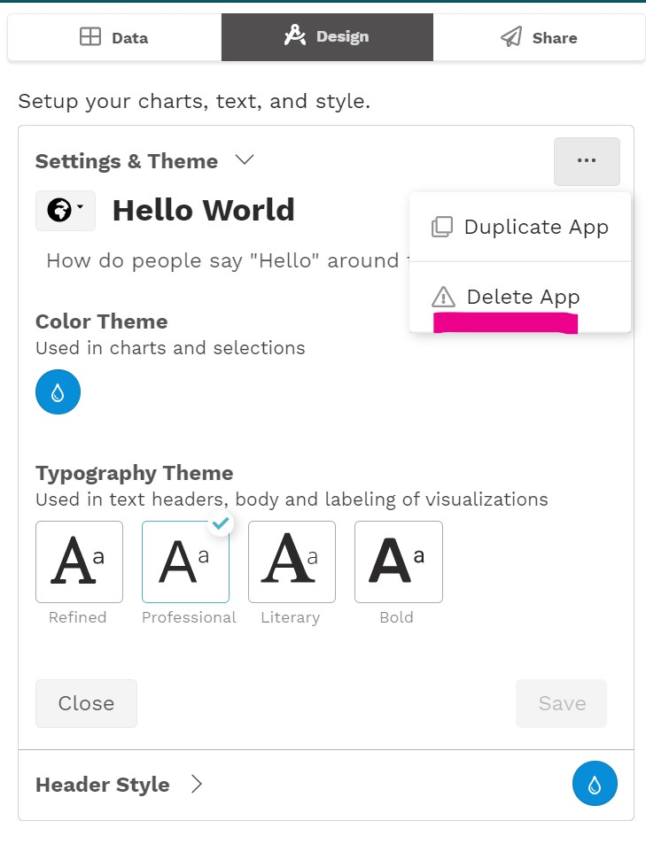
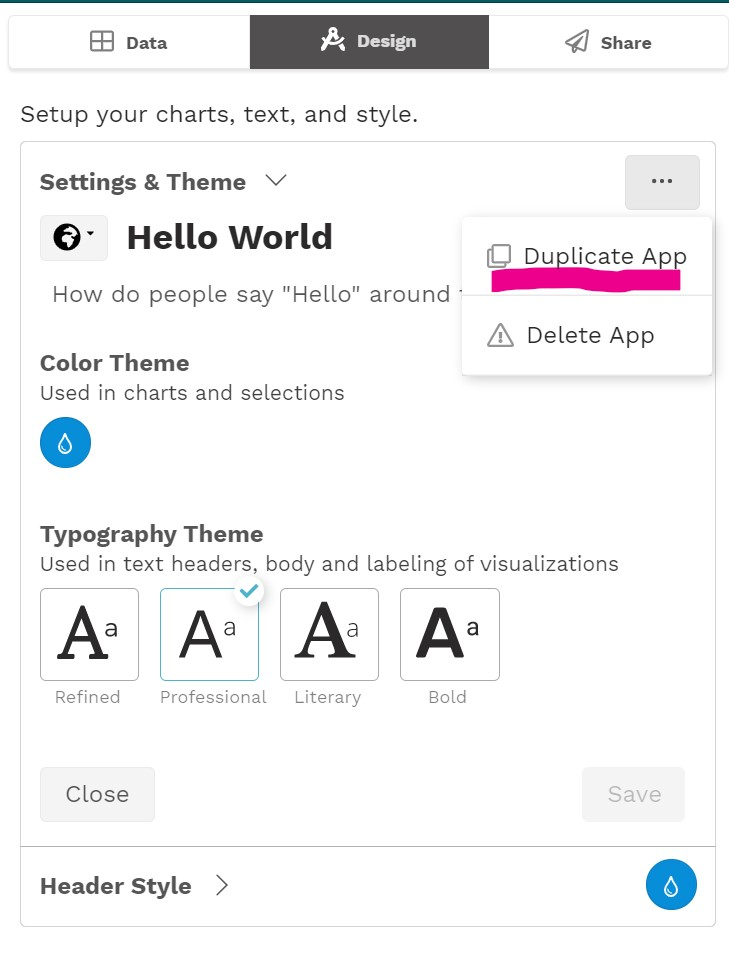

# Settings & Theme

The Settings & Theme section at the top of the Design tab is where you can modify the basic settings for your app \(title, description, icon\), as well as the color and typography themes. Here you can  also delete or duplicate an app. 

To do this, first expand the  Settings & Theme section. Make changes as needed, and then click **Save**. 

## Settings

### Title

The title appears in the apps page and app header. Aim to keep this short, ideally 1-2 words.

### Description

The description appears in the apps page. Here's where you add a bit more detail about your app. Aim to keep it at a sentence or a few phrases in length.

### Icon

This is the icon that will appear on the apps page. Each app starts with a basic icon.

## Themes

### Color theme

Choose the color to use primary color of your app. This color will appear in the apps page, app header, and charts. 

### Typography theme

Choose a typographic style for your app.

### Image background \(future release\)

In a future release, you will be able to select an image to use as the app background, instead of the color.


Changes to settings and themes must be published before they will appear on the apps page.


## More Actions

### Deleting an app

To delete an app, click the menu icon \(\) and select **Delete App**. 

### Duplicating an app

To duplicate an app, click the menu icon \(\) and select **Duplicate App**. Then give your new app a title and select **Duplicate**. Once the new app is created it will open as a draft version, ready for you to make edits and publish.

