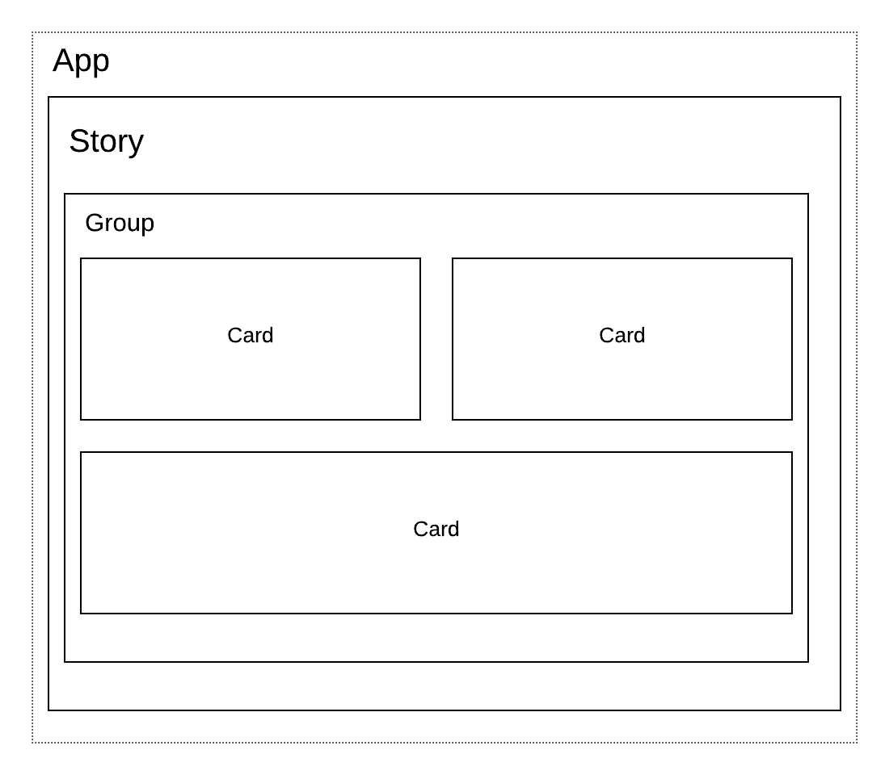

# Components of an App

So what exactly makes up a Juicebox app? Each app has the following parts that flow in a hierarchy:

* Each **application** \(or **app**\) is the solution you are creating for a target audience. An app is what you’ll give users access to when you are ready to share. It can have multiple...
* **Stories** are the analysis and explanatory workflows that guide your users through the data. Each story is composed of one or more…
* **Sections** are the individual sections of your story. Think of them as paragraphs that carry your users through a section of your story. Groups can have a distinct color background and unique layout of its component. \[More a way to control styling.\]
* **Slices** are the most basic building block of your stories. Each slice can have text and/or a visualization.

