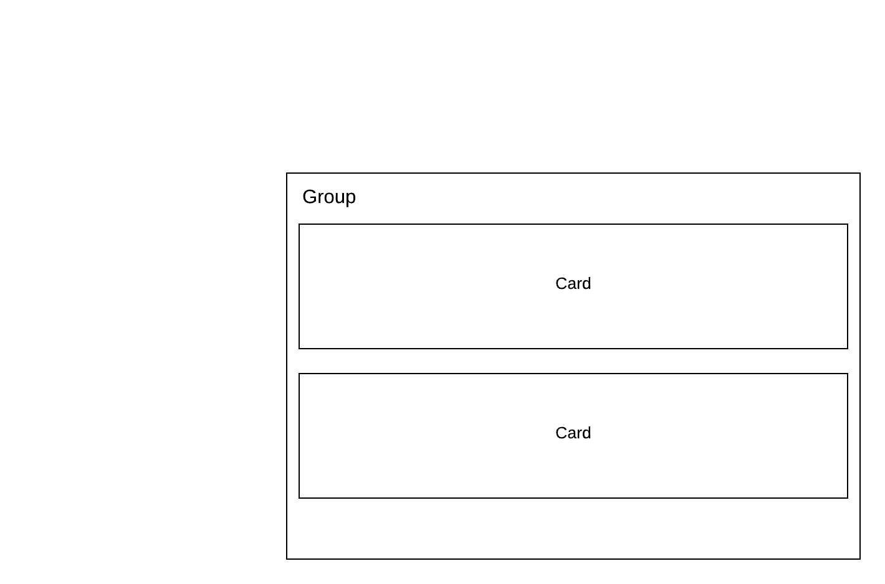
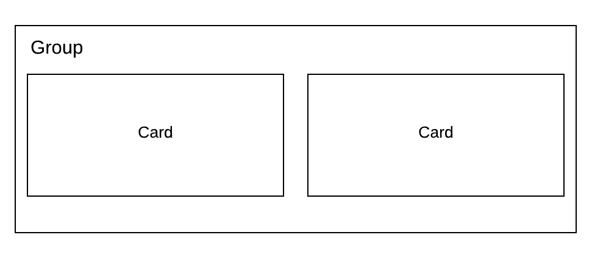

# Layouts \(FIX IMAGES\)

You have control of how you layout the components of your story. By default, the story is going to flow vertically from the initial title and overview to more detailed analysis and data. 

You can choose to layout the cards in a group either vertically:   

   

Or horizontally:  

Within a Card, you have the option to layout the text and visualization in four ways:  

 \(1\)

Text

↓

Viz  

\(2\)

Text → Viz  

\(3\)

Viz → Text  

\(4\)

Viz

↓

Text

