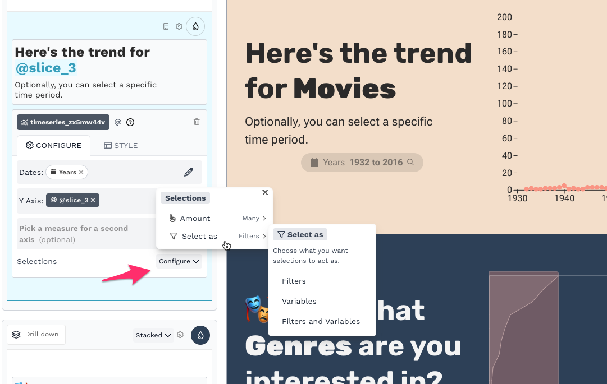

# Adding Users

There are several ways to add users to your workspace, depending on the role you want to assign and your own permissions.

### Adding a user from the People page

Admins and Owners can add a user with any role directly from the People page.

1. From the People page, click the **Add User** button.

<figure><figcaption></figcaption></figure>

2. In the **Add a user** dialog, enter the user's email address, first name, and last name.
3. Select the appropriate **Role** from the dropdown (Viewer, Editor, Admin, or Owner).
4. If the role is **Viewer**, choose which reports the user can access: **All Reports** or **Customized**. If you select Customized, check the specific reports the user should be able to see.
5. Optionally, expand **Data Permissions** to set data permission filters for the user. See Limiting what data users can see for details.

6. Click **Save** to add the user, or **Save and Send Email** to add the user and send them an email notification.

### Adding an editor from the app editor

Editors, Admins, and Owners can invite new Editors from within the app editor. Click the **Add Editor** button in the toolbar at the top of the editor, then choose to create an invite link or send an invitation via email.

<figure><figcaption></figcaption></figure>

The invite link is one-time use. When the person clicks the link, they will be asked to create a Juicebox account (if they don't already have one) and sign in. After signing in, they will be an Editor in your workspace.

### Adding viewers to a report

To invite viewers to a specific report shared as "Sign-in required", open the report in the editor, click the **Sharing** button, and copy the invite link from the **Publish & Share** dialog.

<figure><figcaption></figcaption></figure>

Anyone who clicks the invite link and signs in becomes a Viewer with access to that report. Use **Copy Invite Link** to copy just the URL, or **Copy Invite** to copy a message with the link included.


For reports with "Public link" access, anyone with the link can view the report — no sign-in required.


### Setting up a password for API access

The Juicebox API requires an Admin account with password-based login. By default, Juicebox accounts use passwordless sign-in (email code, Google, or LinkedIn). To set up a password:

1. Add a new user with the **Admin** role from the People page (or have an existing Admin or Owner change a user's role to Admin).
2. The Admin signs in to the workspace using email code sign-in.
3. Once signed in, click the gear icon in the top-right corner of the workspace, then click on your name to open your user profile.
4. Click **Set Password** to set a password.

<figure><figcaption></figcaption></figure>

Once a password is set, the Admin can use their email and password to authenticate with the Juicebox API.
