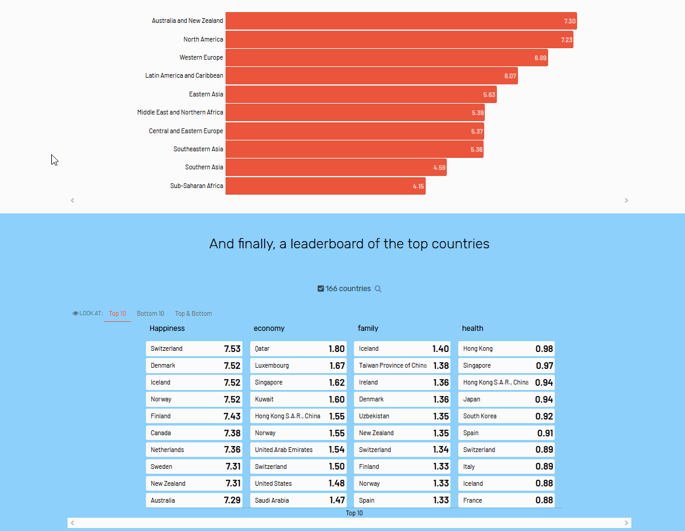
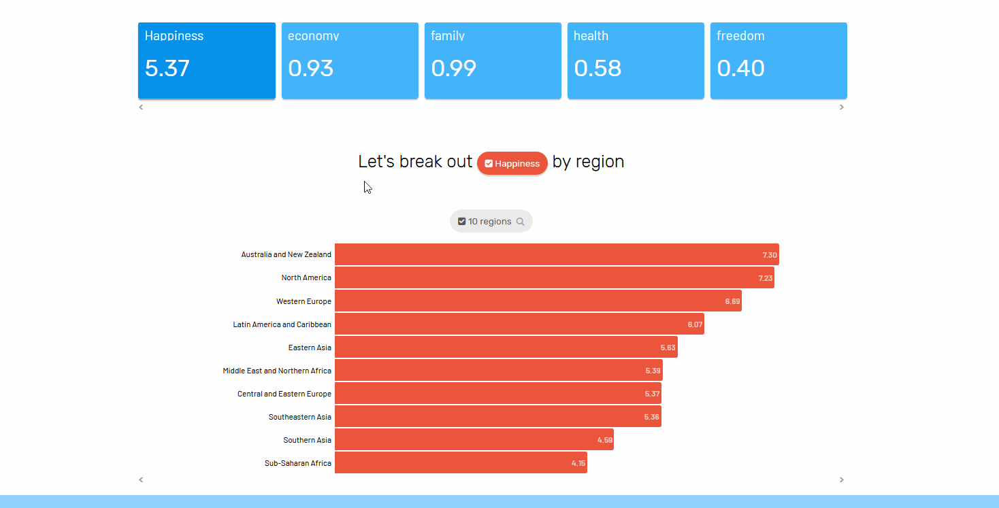

# Data flow

Selections made in a story automatically drive how the story progresses. This is done in two ways: selections as filters and selections as **\[paths? decisions?\]**. **\[Can we describe this better than "capturing user selections"? Every selection is "captured", so not a useful distinction.\]**

### Selections as Filters

Selections in a slice will automatically filter downstream slices. This allows users to drill down on the data that is relevant to their problem. 

In the example below, there are two slices. The top slice has a [**bar**](../authoring-apps/story-designer/charts/ranked-list.md) visualization that shows regions ****ranked by **\[Y\]**, and the bottom slice has a [**leaderboard**](../authoring-apps/story-designer/charts/leaderboard.md) visualization that shows which countries lead across multiple measures. Notice that when nothing is selected in the bar visualization, the leaderboard shows the leaders across all countries. But when a particular region is selected in the bar visualization \(i.e., Western Europe\), the leaderboard only ranks countries within the selected region. 

### Capturing User Selections

Certain charts \(like the measure chooser and dimension chooser\) can capture user selections you want to use to drive other charts.   
  
In this example, a user can select a measure \(like Happiness or Family\) using the **measure chooser**. This selection drives what data the **ranked list** displays to the user. 

